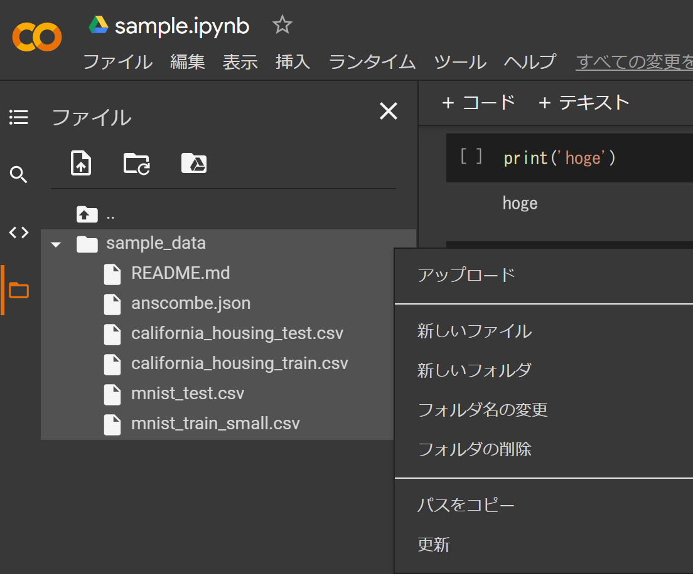
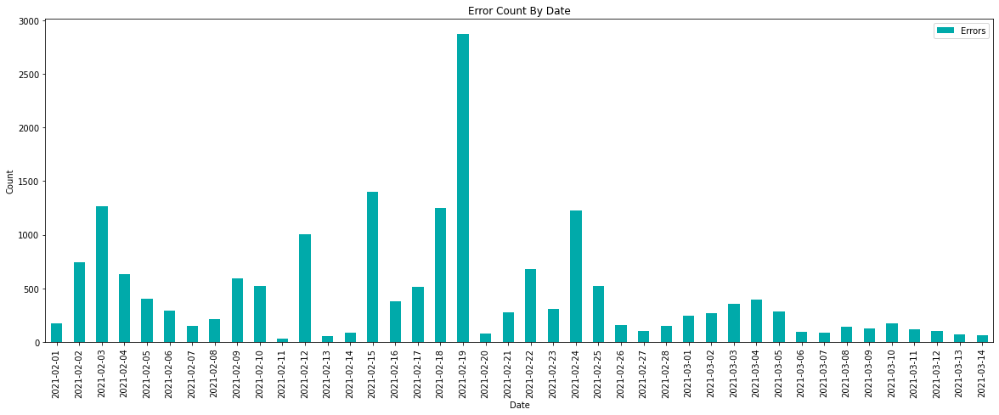

整形済みデータは次のようなフォーマット

- sample_data/sorted_array.json

```json
[
  [
    "2021-02-01",
    "169"
  ],
  [
    "2021-02-02",
    "746"
  ],
  [
    "2021-02-03",
    "1267"
  ],
  [
    "2021-02-04",
    "632"
  ],
  [
    "2021-02-05",
    "401"
  ],
  [
    "2021-02-06",
    "288"
  ]
]
```

## JSONファイルのアップロード

GUIで行う

ファイルをやりとりするには事前に`接続`しておく必要がある



## 実行

コードは次のような感じ

```python
import matplotlib.pyplot as plt
import json
import pandas as pd

df = pd.read_json('sample_data/sorted_array.json')
df.set_index(0, inplace=True)

ax = df.plot(kind='bar', title='Error Count By Date', figsize=(20,7), color='#00AAAA')
ax.set_xlabel('Date')
ax.set_ylabel('Count')
ax.legend(['Errors'])
```

それっぽくなった



colab初めて触ったけどjupyter notebookがブラウザから簡単に使えるのかなり良い

`Ctrl+Enterで実行`や`Shift+Enterで次のコードへ遷移`などjupyter notebookと同じ使い心地

<!-- textlint-disable ja-technical-writing/ja-no-weak-phrase -->
あまりさわれる機会が多くないがしばらく使ってみようと思う
<!-- textlint-enable ja-technical-writing/ja-no-weak-phrase -->