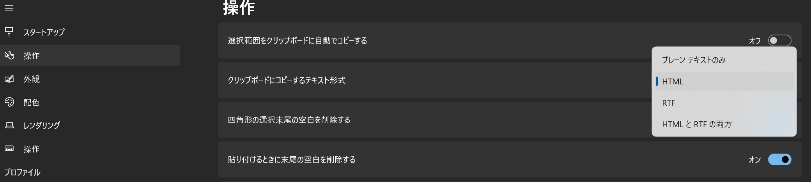

[Windows Terminal Interaction Settings | Microsoft Learn](https://learn.microsoft.com/en-us/windows/terminal/customize-settings/interaction)

RTF、HTML、もしくは両方でもコピーできる

Terminalの出力結果を色付きでGoogleSlideに貼り付けたかったので調べた

GoogleSlideに貼り付けたら、HTMLだと書式がコピーされた
