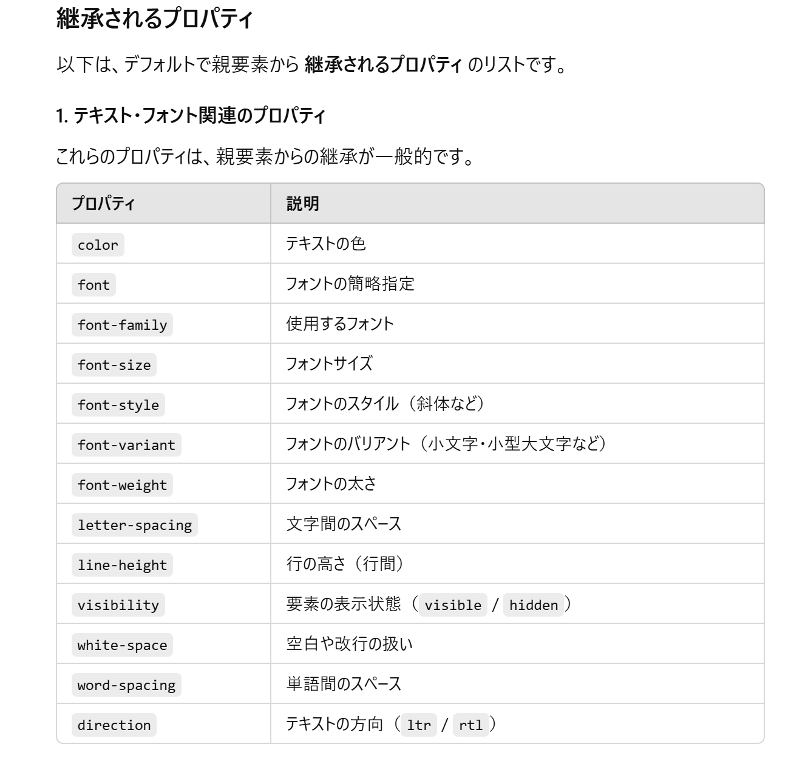
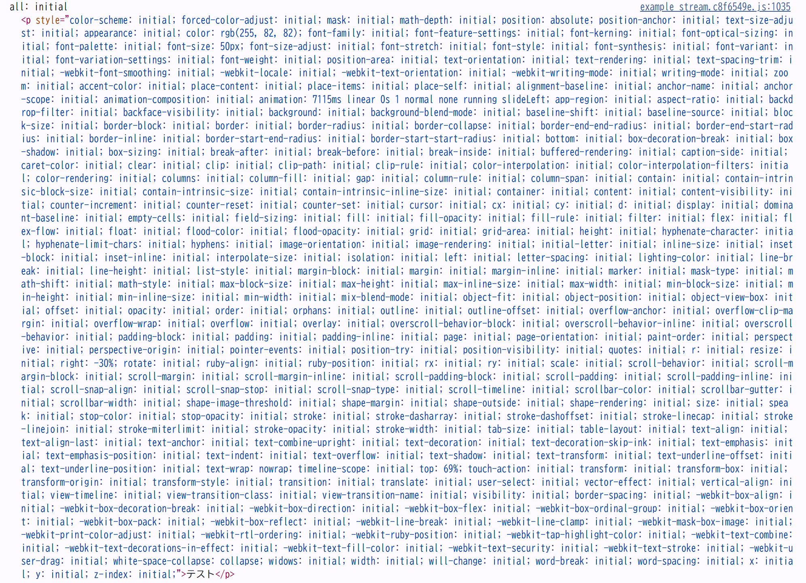

<!-- textlint-disable ja-technical-writing/ja-no-weak-phrase -->
Chrome拡張で`document.createElement`などでタグを生成して既存のコンテンツページに追加するというような操作はよくあるかと思うが
<!-- textlint-enable ja-technical-writing/ja-no-weak-phrase -->

あらかじめそのサイトで設定されていたスタイルが適用されてしまうケースが存在する（`div`など特定のタグ粒度に対してのスタイル設定など）

これが意図したものではなく、スタイル未適用のほうが望ましい

ブラウザ拡張でタグを突っ込む場合は下手にユーザーエージェントスタイルシートの影響を受けたくない

そんな場合に使える`all`プロパティ

```html
<div style="all: unset; color: red;"> この要素はデフォルトのスタイルが解除されています </div>
<div style="all: initial; color: red;"> この要素はすべてのスタイルが初期値にリセットされています </div>
```
initialはすべてリセット

unsetは親要素から一部プロパティを継承するらしい

継承されるプロパティ



なるほど

- 拡張内での一例

```typescript
  const element = document.createElement("p")
  element.style.all = "initial"
  element.innerText = "テスト"
  console.log("all: initial", element)
```

こんな感じで出してみた



この記述方法だとすべてのプロパティに対して`initial`がセットされるみたい
