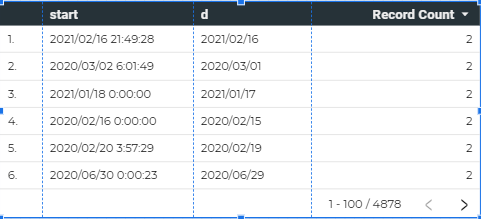

ただのメモ

TogglからBigQueryにデータを突っ込んでいてそれをDataPortal経由でグラフ化している

`start: 2020-12-25 21:52:30 UTC`（実際計測している時刻UTCではなくAsia/TokyoだがToggl側のAPIが返す値は時刻+UTCという値が返ってきている）

上記のようなフォーマットのカラムを午前9時を堺にグルーピングしたいという要件が出てきた

## 経緯

単にグラフ化した場合`start`を基準にして日付単位でグループ化すると

睡眠時間によっては日の合計時間が24時間を超えてしまうためグラフを眺めていて違和感がある

そのため現在は0時をまたいで睡眠をとった場合は0時を境に分割して記録している

```
睡眠: 2021-04-09 22:00:00 ～ 2021-04-10 07:00:00
Toggl上での記録: 
- 2021-04-09 22:00:00 ～ 2021-04-10 00:00:00
- 2021-04-10 00:00:00 ～ 2021-04-10 07:00:00
```

そうすると正確な日付としては分割して結果を閲覧できるが自分の体感としての日の睡眠時間がずれてグラフ化されてしまう

そこで、冒頭のように午前9時開始を堺に日付を分割して0-9時のデータは前日分としてグラフ上では扱えるようにする

そのための計算フィールドの計算式が下記

```sql
if(
  parse_datetime(
    "%Y-%m-%dT%H",
    format_datetime("%Y-%m-%dT%H",start)
  ) < parse_datetime(
    "%Y-%m-%dT%H",
    format_datetime("%Y-%m-%dT09",start)
  ),
  parse_date("%Y-%m-%d" ,format_datetime("%Y-%m-%d", datetime_sub(start, INTERVAL 1 DAY))),
  parse_date("%Y-%m-%d" ,format_datetime("%Y-%m-%d", start))
)
```

## つまずきポイント
- DataPortalで日付カラムとして扱う場合はDate型かDateTime型になっている必要があるので結果に`parse_date`などパース処理が必要
- `start`自体も日付・時刻カラムだったのでまず`format_datetime`でフォーマットしてからさらに`parse_datetime`で比較させて上げる必要があった
- よく考えれば分かるはずだったがDataPortal上のテーブルで可視化すると別のフォーマットで出力されてしまい若干混乱した

こんな感じで午前9時を境に日付を変更できた

