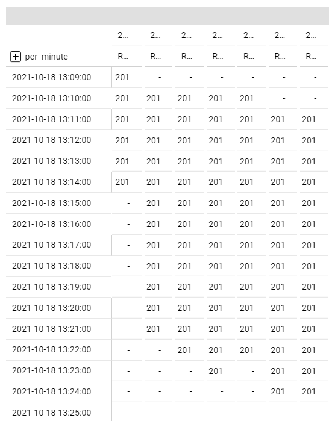

- seconds

```
2021-10-15 03:04:30
```

- 分ごと

```
FORMAT_DATETIME("%Y-%m-%d %H:%M:00", seconds)
```

- 10秒ごと

```
CONCAT(FORMAT_DATETIME("%Y-%m-%d %H:%M:", seconds), SUBSTR( FORMAT_DATETIME("%S", seconds),1,1),"0")
```

- 30秒ごと

```
CONCAT(FORMAT_DATETIME("%Y-%m-%d %H:%M:", seconds), IF(SECOND(seconds) > 30, "30", "00"))
```



albのログから秒数ごとのサーバの状況を把握したいパターンがあったので頑張った

別途SQLでよしなに頑張るものの頑張った後は上記のようにpivotの行を計算フィールドとして設定する

分以下の細かな粒度でどのリクエストがいつ始まっていつ終わったか、ステータスコードは何かみたいなのがさっと閲覧できるようになった

レコードが多すぎるとかなり重くなるので気を付ける必要はある

ここまでやっておいて、この辺はAPM入れたほうが良さそうな気もしてきた
