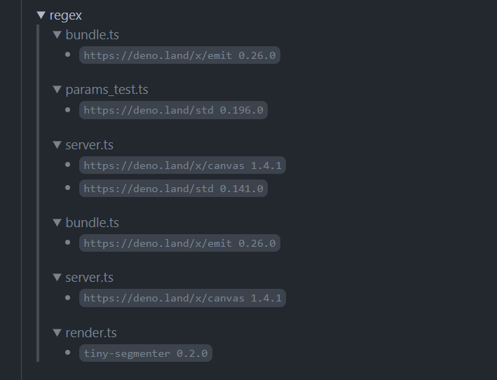

下記参考にした

[Renovate で Deno の依存関係を自動で更新する](https://blog.s2n.tech/articles/renovate-deno)

[https://blog.s2n.tech/articles/renovate-deno:embed:cite]

Renovateは正規表現を使って対象のファイル、モジュール、バージョンを特定できる機能がある

それを使ってDenoのモジュールのバージョン更新を検知してRenovate経由で更新できるようにする

- renovate.json

```json
{
  "$schema": "https://docs.renovatebot.com/renovate-schema.json",
  "extends": [
    "config:base"
  ],
  "regexManagers": [
    {
      "fileMatch": ["\\.tsx?$"],
      "matchStrings": [
        "(?:im|ex)port(?:.|\\s)+?from\\s*['\"](?<depName>https://deno.land/.+?)@v?(?<currentValue>\\d+?\\.\\d+?\\.\\d+?).*?['\"]"
      ],
      "datasourceTemplate": "deno"
    },
    {
      "fileMatch": ["\\.tsx?$"],
      "matchStrings": [
        "(?:im|ex)port(?:.|\\s)+?from\\s*['\"](?<depName>https://deno.land/x/.+?)@v?(?<currentValue>\\d+?\\.\\d+?\\.\\d+?).*?['\"]"
      ],
      "datasourceTemplate": "deno"
    },
    {
      "fileMatch": ["\\.tsx?$"],
      "matchStrings": [
        "(?:im|ex)port(?:.|\\s)+?from\\s*['\"]https://esm.sh/(?<depName>.+?)@v?(?<currentValue>\\d+?\\.\\d+?\\.\\d+?).*?['\"]"
      ],
      "datasourceTemplate": "npm"
    }
  ]
}
```

プロジェクト自体雑に作ってしまったため参考記事のように`import_map`ないし、Denoの流儀にも沿っていないところがありそう…

下記のパターンがあったのでそれぞれ追加した

- deno std
    - 参考そのまま
- deno.land/x
    - サードパーティモジュール、参考の正規表現の内容に`x/`を加えただけ
- esm.sh
    - 正規表現は参考サイトから少しだけ変更した
    - datasourceはnpm


結果、反映された


