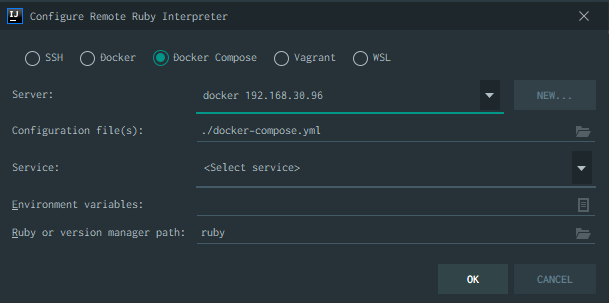
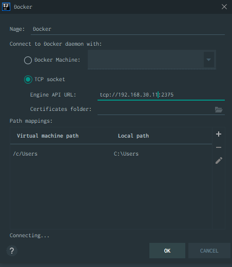

## 前提環境
- Windows 10
- CentOS7
- IntelliJ 2020.1.2

ホストのIntelliJでVM上のdockerを使って開発する場合

dockerのAPIをたたくためにTCP接続を可能にする必要がある

CentOSの場合、docker serviceの起動オプションを変える

### 設定

- /usr/lib/systemd/system/docker.service

```diff
[Service]
- ExecStart=/usr/bin/dockerd -H unix://
+ ExecStart=/usr/bin/dockerd -H tcp://0.0.0.0:2375
```

- リロード

```shell
systemctl daemon-reload
service docker start
```

`Project Structure` -> `+` -> `Add Ruby SDK`



Docker Composeを選んで`New`ボタンを押下



API URLを指定する箇所があるのでVMのURLを設定する

## VMからの操作

そのままコマンド実行するとdocker daemonの起動オプションを変えたのでエラーが出る

### エラー

```
ERROR: Couldn't connect to Docker daemon at http+docker://localhost - is it running?

If it's at a non-standard location, specify the URL with the DOCKER_HOST environment variable.
```

### 対応

実行時に`DOCKER_HOST`の値を読みに行き、設定があれば問い合わせるようになっている

```
export DOCKER_HOST=192.168.30.95:2375
```

これでVMからのdockerコマンドの実行も問題なく実行できるようになった
