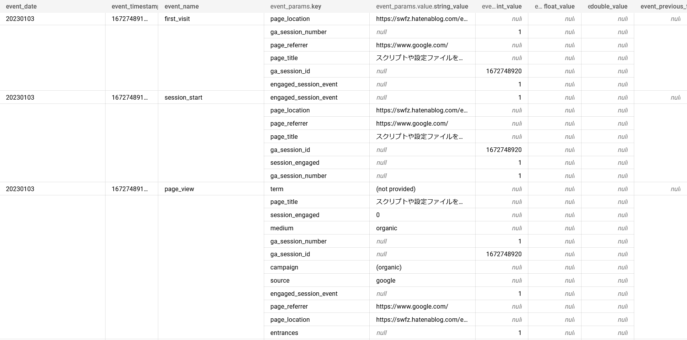
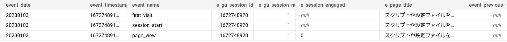
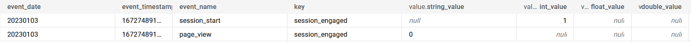

GA4のデータをBigQueryにエクスポートして、DataformでゴニョゴニョしてからLookerStudioで可視化するということをやってた

そもそもGA4のデータは`event_params`がREPEATEDなのでLookerStudioなどで可視化する場合はひと手間入れてあげるほうが使いやすい

ということで`event_params`をフラットにして各イベントのキーをカラムとして扱うようにしてた

下記を参考にとりあえずはイベントの名前(event_params.key)は決め打ちで進めた

[Googleアナリティクス4のBigQueryエクスポート仕様 – marketechlabo](https://www.marketechlabo.com/ga4-bigquery-export-spec/#UNNEST)

### イメージ

- before



- after



実際のSQLはこんな感じ（一部抜粋）

```sql
SELECT
  event_date,
  event_timestamp,
  event_name,
  (SELECT e.value.int_value FROM UNNEST(event_params) e WHERE e.key = 'ga_session_id' ) e_ga_session_id,
  (SELECT e.value.int_value FROM UNNEST(event_params) e WHERE e.key = 'ga_session_number' ) e_ga_session_number,
  (SELECT e.value.string_value FROM UNNEST(event_params) e WHERE e.key = 'session_engaged' ) e_session_engaged,
  (SELECT e.value.string_value FROM UNNEST(event_params) e WHERE e.key = 'page_title' ) e_page_title
FROM `project.dataset.events_20230103`
```

各種valueは`event_params.value.string_value`, `event_params.value.int_value`.... といったように`event_params.key`によって値の型が異なるのでどのカラムにデータが格納されるかが変わる

しかし、いくつか確認してみたところ`session_engaged`の場合、`event_name`の値によって格納されるカラム（`int_value`,`string_value`）が違うようだった



- SQL

```sql
SELECT
  event_date,
  event_timestamp,
  event_name,
  event.key,
  event.value
FROM
  `project.dataset.events_20230103`,
  UNNEST(event_params) AS event
WHERE
  AND event.key = 'session_engaged'
```

なんと…

迷った末いったん実際のSQLは`session_engagement`のみ次のような書き方でお茶を濁した

```SQL
(SELECT COALESCE(e.value.string_value, SAFE_CAST(e.value.int_value AS STRING)) FROM UNNEST(event_params) e WHERE e.key = 'session_engaged' ) e_session_engaged
```

とりあえず統一して扱えるようにはなった