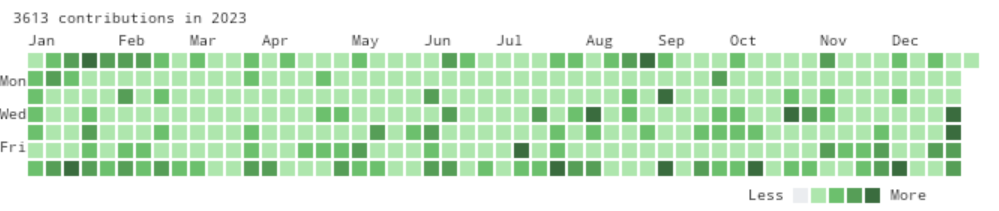

[Kusa Image](https://kusa-image.deno.dev/)ではサーバ側でGitHubのGraphQL APIを利用している

勝手に1年分?のデータがしっかり返ってくるんだろうと思っていたが、いくつか出力した画像を確認したらGitHubで閲覧できる草と微妙に差がありそう…とういことで調べてみた

よく調べてみると正確に1年分ではなさそうという話


## 公式Doc

[オブジェクト - GitHub Docs](https://docs.github.com/ja/graphql/reference/objects#contributionscollection)

一応読んだうえで調べた

## GraphQLのQuery

下記のクエリを叩いている

```typescript
  const query = `
    query($user:String!) {
      user(login: $user){
        contributionsCollection${to ? `(to:"${to}T00:00:00")` : ""} {
          contributionCalendar {
            totalContributions
            colors
            isHalloween
            weeks {
              contributionDays {
                color
                contributionCount
                contributionLevel
                date
              }
            }
          }
        }
      }
    }
  `;
```

`to`には`YYYY-MM-DD`の形式で日付が渡される

## デバッグしてみた

このデバッグ結果を出すまでにもかなりいろいろためしたがメモ残してなかったのでこれだけ

上記のクエリで受け取ったレスポンスを数年分集計してログに出してみた

### 検証コード

<!-- textlint-disable ja-technical-writing/ja-no-weak-phrase -->
一部抜粋なので全然何のこと?って感じだと思うけど一応載せておく
<!-- textlint-enable ja-technical-writing/ja-no-weak-phrase -->

```typescript
      const weeks = data.data.user.contributionsCollection.contributionCalendar.weeks;
      const len = weeks.reduce((n, w) => n + w.contributionDays.length, 0);
      console.log(
        'to:', `${year}-12-31`,
        ', 日数: ', len,
        ', 週数: ', weeks.length,
        ', 最後', weeks.at(-1).contributionDays.at(-1).date,
        ': ', weeks.at(-1).contributionDays.at(-1).contributionCount,
        ', 最初', weeks[0].contributionDays[0].date,
        ': ', weeks[0].contributionDays[0].contributionCount,
        ', 最終週: ', weeks.at(-1).contributionDays.length,
        `${[2044,2040,2036,2032,2028,2024,2020,2016,2012,2008,2004,2000,1996].includes(year) ? '閏年' : ''}`
      );
```

### 出力の内容

「to」は上記クエリに渡しているパラメータ

「日数」は返ってきたレスポンスの総日数

「週数」は返ってきたレスポンスの総週数

「最初」の項目は各コントリビューションのデータの最初の日付とcontributionCount

「最後」の項目は各コントリビューションのデータの最後の日付とcontributionCount

「最終週」の項目は最終週の配列のlength、1なら日曜で終わり、2なら月曜日で終わり、要は今のクエリだと`to`の日付が何曜日か、1が日曜で7が土曜

最後にうるう年かどうかのフラグ、これは調べて決め打ちでチェックした

```
to: 2024-12-31 , 日数: 367 , 週数: 53 , 最後 2024-12-31 : 0 , 最初 2023-12-31 : 10 , 最終週: 3 閏年  
to: 2023-12-31 , 日数: 365 , 週数: 53 , 最後 2023-12-31 : 10 , 最初 2023-01-01 : 3 , 最終週: 1  
to: 2022-12-31 , 日数: 366 , 週数: 53 , 最後 2022-12-31 : 15 , 最初 2021-12-31 : 11 , 最終週: 7  
to: 2021-12-31 , 日数: 366 , 週数: 53 , 最後 2021-12-31 : 11 , 最初 2020-12-31 : 4 , 最終週: 6  
to: 2020-12-31 , 日数: 367 , 週数: 53 , 最後 2020-12-31 : 4 , 最初 2019-12-31 : 0 , 最終週: 5 閏年  
to: 2019-12-31 , 日数: 366 , 週数: 53 , 最後 2019-12-31 : 0 , 最初 2018-12-31 : 0 , 最終週: 3  
to: 2018-12-31 , 日数: 366 , 週数: 53 , 最後 2018-12-31 : 0 , 最初 2017-12-31 : 2 , 最終週: 2  
to: 2017-12-31 , 日数: 365 , 週数: 53 , 最後 2017-12-31 : 2 , 最初 2017-01-01 : 0 , 最終週: 1  
to: 2016-12-31 , 日数: 367 , 週数: 53 , 最後 2016-12-31 : 0 , 最初 2015-12-31 : 4 , 最終週: 7 閏年  
to: 2015-12-31 , 日数: 366 , 週数: 53 , 最後 2015-12-31 : 4 , 最初 2014-12-31 : 0 , 最終週: 5  
to: 2014-12-31 , 日数: 366 , 週数: 53 , 最後 2014-12-31 : 0 , 最初 2013-12-31 : 0 , 最終週: 4  
to: 2013-12-31 , 日数: 366 , 週数: 53 , 最後 2013-12-31 : 0 , 最初 2012-12-31 : 0 , 最終週: 3  
to: 2012-12-31 , 日数: 366 , 週数: 53 , 最後 2012-12-31 : 0 , 最初 2012-01-01 : 0 , 最終週: 2 閏年  
to: 2011-12-31 , 日数: 366 , 週数: 53 , 最後 2011-12-31 : 0 , 最初 2010-12-31 : 0 , 最終週: 7  
to: 2010-12-31 , 日数: 366 , 週数: 53 , 最後 2010-12-31 : 0 , 最初 2009-12-31 : 0 , 最終週: 6  
to: 2009-12-31 , 日数: 366 , 週数: 53 , 最後 2009-12-31 : 0 , 最初 2008-12-31 : 0 , 最終週: 5  
to: 2008-12-31 , 日数: 367 , 週数: 53 , 最後 2008-12-31 : 0 , 最初 2007-12-31 : 0 , 最終週: 4 閏年  
to: 2007-12-31 , 日数: 366 , 週数: 53 , 最後 2007-12-31 : 0 , 最初 2006-12-31 : 0 , 最終週: 2  
to: 2006-12-31 , 日数: 365 , 週数: 53 , 最後 2006-12-31 : 0 , 最初 2006-01-01 : 0 , 最終週: 1  
to: 2005-12-31 , 日数: 366 , 週数: 53 , 最後 2005-12-31 : 0 , 最初 2004-12-31 : 0 , 最終週: 7  
to: 2004-12-31 , 日数: 367 , 週数: 53 , 最後 2004-12-31 : 0 , 最初 2003-12-31 : 0 , 最終週: 6 閏年  
to: 2003-12-31 , 日数: 366 , 週数: 53 , 最後 2003-12-31 : 0 , 最初 2002-12-31 : 0 , 最終週: 4  
to: 2002-12-31 , 日数: 366 , 週数: 53 , 最後 2002-12-31 : 0 , 最初 2001-12-31 : 0 , 最終週: 3  
to: 2001-12-31 , 日数: 366 , 週数: 53 , 最後 2001-12-31 : 0 , 最初 2000-12-31 : 0 , 最終週: 2  
to: 2000-12-31 , 日数: 365 , 週数: 53 , 最後 2000-12-31 : 0 , 最初 2000-01-02 : 0 , 最終週: 1 閏年  
to: 1999-12-31 , 日数: 366 , 週数: 53 , 最後 1999-12-31 : 0 , 最初 1998-12-31 : 0 , 最終週: 6  
to: 1998-12-31 , 日数: 366 , 週数: 53 , 最後 1998-12-31 : 0 , 最初 1997-12-31 : 0 , 最終週: 5  
to: 1997-12-31 , 日数: 366 , 週数: 53 , 最後 1997-12-31 : 0 , 最初 1996-12-31 : 0 , 最終週: 4  
to: 1996-12-31 , 日数: 367 , 週数: 53 , 最後 1996-12-31 : 0 , 最初 1995-12-31 : 0 , 最終週: 3 閏年  
to: 1995-12-31 , 日数: 365 , 週数: 53 , 最後 1995-12-31 : 0 , 最初 1995-01-01 : 0 , 最終週: 1
```

## 仕様の考察

なんとか勝手に納得いくところまで来た

APIの仕様を推察すると

与えられた範囲パラメータを元に

- 53週分表示（これは固定）
- 366日分（うるう年の場合は367）

を返すようにしているっぽい

### 365日分の年は?

2023年、2017年は12/31が日曜の年

日曜が最終日なので週のレコード数は1



この画像の右端部分

そこを起点に366日分並べていくと54週になってしまうためカットされているので365日分のレスポンスが返ってくると思われる

カットしても1/1スタートになるため1年分は担保できているっていう感じっぽい?

それなら閏年かつ12/31が日曜日のときはどうなるの?と思い対象期間を伸ばしてだしてみたところやはりビンゴだった

2000年は1/2が最初のデータになっていたのでそういうことですねって感じで納得＋スッキリ

<!-- textlint-disable ja-technical-writing/ja-no-weak-phrase -->
このときはGitHubなかったと思う?ので問題ないのかな
<!-- textlint-enable ja-technical-writing/ja-no-weak-phrase -->

GitHubがスタートしたのは2008年かららしいのでまぁ範囲外だった、何年かに一度は問題起きるけど通常は問題起きないよねっていうケースのよう

次いつ来るんだろうか…見てみたい

未来の期間もクエリはできたので将来いつ起きるのかな?と調べてみた

```
to: 2044-12-31 , 日数: 367 , 週数: 53 , 最後 2044-12-31 : 0 , 最初 2043-12-31 : 0 , 最終週: 7 閏年  
to: 2043-12-31 , 日数: 366 , 週数: 53 , 最後 2043-12-31 : 0 , 最初 2042-12-31 : 0 , 最終週: 5  
to: 2042-12-31 , 日数: 366 , 週数: 53 , 最後 2042-12-31 : 0 , 最初 2041-12-31 : 0 , 最終週: 4  
to: 2041-12-31 , 日数: 366 , 週数: 53 , 最後 2041-12-31 : 0 , 最初 2040-12-31 : 0 , 最終週: 3  
to: 2040-12-31 , 日数: 366 , 週数: 53 , 最後 2040-12-31 : 0 , 最初 2040-01-01 : 0 , 最終週: 2 閏年  
to: 2039-12-31 , 日数: 366 , 週数: 53 , 最後 2039-12-31 : 0 , 最初 2038-12-31 : 0 , 最終週: 7  
to: 2038-12-31 , 日数: 366 , 週数: 53 , 最後 2038-12-31 : 0 , 最初 2037-12-31 : 0 , 最終週: 6  
to: 2037-12-31 , 日数: 366 , 週数: 53 , 最後 2037-12-31 : 0 , 最初 2036-12-31 : 0 , 最終週: 5  
to: 2036-12-31 , 日数: 367 , 週数: 53 , 最後 2036-12-31 : 0 , 最初 2035-12-31 : 0 , 最終週: 4 閏年  
to: 2035-12-31 , 日数: 366 , 週数: 53 , 最後 2035-12-31 : 0 , 最初 2034-12-31 : 0 , 最終週: 2  
to: 2034-12-31 , 日数: 365 , 週数: 53 , 最後 2034-12-31 : 0 , 最初 2034-01-01 : 0 , 最終週: 1  
to: 2033-12-31 , 日数: 366 , 週数: 53 , 最後 2033-12-31 : 0 , 最初 2032-12-31 : 0 , 最終週: 7  
to: 2032-12-31 , 日数: 367 , 週数: 53 , 最後 2032-12-31 : 0 , 最初 2031-12-31 : 0 , 最終週: 6 閏年  
to: 2031-12-31 , 日数: 366 , 週数: 53 , 最後 2031-12-31 : 0 , 最初 2030-12-31 : 0 , 最終週: 4  
to: 2030-12-31 , 日数: 366 , 週数: 53 , 最後 2030-12-31 : 0 , 最初 2029-12-31 : 0 , 最終週: 3  
to: 2029-12-31 , 日数: 366 , 週数: 53 , 最後 2029-12-31 : 0 , 最初 2028-12-31 : 0 , 最終週: 2  
to: 2028-12-31 , 日数: 365 , 週数: 53 , 最後 2028-12-31 : 0 , 最初 2028-01-02 : 0 , 最終週: 1 閏年  
to: 2027-12-31 , 日数: 366 , 週数: 53 , 最後 2027-12-31 : 0 , 最初 2026-12-31 : 0 , 最終週: 6  
to: 2026-12-31 , 日数: 366 , 週数: 53 , 最後 2026-12-31 : 0 , 最初 2025-12-31 : 0 , 最終週: 5  
to: 2025-12-31 , 日数: 366 , 週数: 53 , 最後 2025-12-31 : 0 , 最初 2024-12-31 : 0 , 最終週: 4
```

近い将来だと次の閏年じゃんw

2028年はこの現象が起きるはず!

### 367日分の年は?

これも53週までしか返さないという仕様によるものかと思われる

うるう年の年は基本367日分のデータが返っているが、年の最終日が2（月曜日）の年は366日分が返ってきている

これは最初の週は7つデータが入っているのでこれ以上入らないという感じで説明が付きそう

## おまけ

contributionsCollectionの`to`,`from`はDateTime型を期待されているようだったので、変えたらどうなるんだろうと思い調べてみた

- contributions.graphql

```graphql
query($userName:String! $from:DateTime $to:DateTime) {
  user(login: $userName){
    contributionsCollection(from: $from, to: $to) {
      contributionCalendar {
        totalContributions
        colors
        isHalloween
        weeks {
          contributionDays {
            color
            contributionCount
            contributionLevel
            date
          }
        }
      }
    }
  }
}
```

- 最初と最後のデータを出力

```bash
gh api graphql -f query="$(cat contributions.graphql)" -f userName=swfz | jq '.data.user.contributionsCollection.contributionCalendar.weeks|[.[0].contributionDays[0],(.[length-1].contributionDays|.[length-1])]'
[
  {
    "color": "#40c463",
    "contributionCount": 13,
    "contributionLevel": "SECOND_QUARTILE",
    "date": "2023-12-17"
  },
  {
    "color": "#40c463",
    "contributionCount": 11,
    "contributionLevel": "SECOND_QUARTILE",
    "date": "2024-12-18"
  }
]
```

- 2022

```bash
gh api graphql -f query="$(cat contributions.graphql)" -f userName=swfz -f from=2022-01-01T00:00:00Z -f to=2022-12-31T23:59:59Z | jq '.data.user.contributionsCollection.contributionCalendar.weeks|[.[0].contributionDays[0],(.[length-1].contributionDays|.[length-1])]'
[
  {
    "color": "#40c463",
    "contributionCount": 23,
    "contributionLevel": "SECOND_QUARTILE",
    "date": "2022-01-01"
  },
  {
    "color": "#9be9a8",
    "contributionCount": 15,
    "contributionLevel": "FIRST_QUARTILE",
    "date": "2022-12-31"
  }
]
```

- toの時刻を`00:00:00`にした場合

```bash
gh api graphql -f query="$(cat contributions.graphql)" -f userName=swfz -f from=2022-01-01T00:00:00Z -f to=2022-12-31T00:00:00Z | jq '.data.user.contributionsCollection.contributionCalendar.weeks|[.[0].contributionDays[0],(.[length-1].contributionDays|.[length-1])]'
[
  {
    "color": "#40c463",
    "contributionCount": 23,
    "contributionLevel": "SECOND_QUARTILE",
    "date": "2022-01-01"
  },
  {
    "color": "#9be9a8",
    "contributionCount": 15,
    "contributionLevel": "FIRST_QUARTILE",
    "date": "2022-12-31"
  }
]
```


- fromのとき刻を`23:59:59`にした

```bash
gh api graphql -f query="$(cat contributions.graphql)" -f userName=swfz -f from=2022-01-01T23:59:59Z -f to=2022-12-31T00:00:00Z | jq '.data.user.contributionsCollection.contributionCalendar.weeks|[.[0].contributionDays[0],(.[length-1].contributionDays|.[length-1])]'
[
  {
    "color": "#40c463",
    "contributionCount": 23,
    "contributionLevel": "SECOND_QUARTILE",
    "date": "2022-01-01"
  },
  {
    "color": "#9be9a8",
    "contributionCount": 15,
    "contributionLevel": "FIRST_QUARTILE",
    "date": "2022-12-31"
  }
]
```

両方ContributionCountの数は変わらず

ということで日付部分しか見てなさそう、データ量を考慮してもサマリーされたテーブルを参照するだろうしDateTimeで問い合わせる理由なさそうなんだけどな

<!-- textlint-disable ja-technical-writing/ja-no-weak-phrase -->
何か理由があるかもしれないが、推測くらいしかできないのでここで終わり、日付だけで投げさせてもらいたい感がある…
<!-- textlint-enable ja-technical-writing/ja-no-weak-phrase -->
