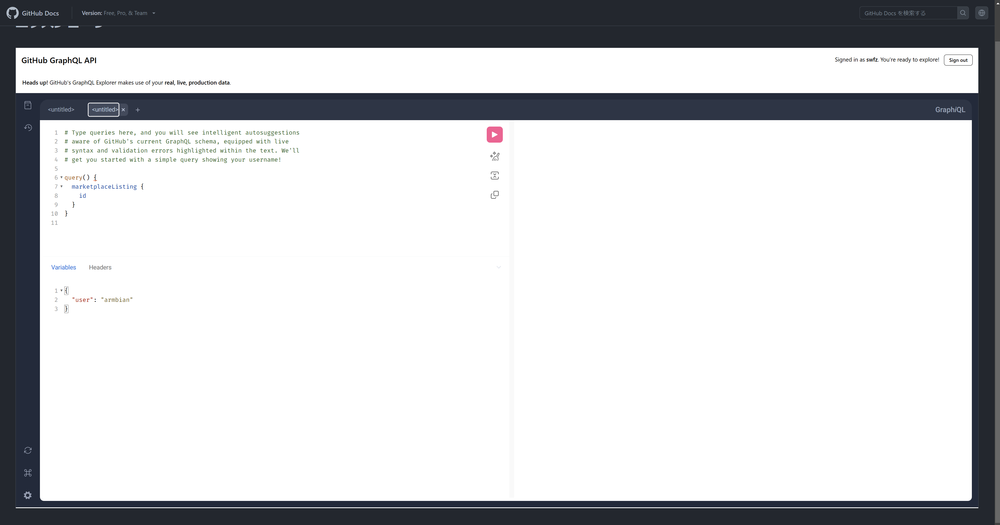

<!-- textlint-disable ja-technical-writing/ja-no-weak-phrase -->
GitHubのGraphQL APIにクエリする場合、まず下記のExplorerを使ってクエリの調整することが多いと思う
<!-- textlint-enable ja-technical-writing/ja-no-weak-phrase -->

[エクスプローラー - GitHub Docs](https://docs.github.com/ja/graphql/overview/explorer)

ただ、Explorer自体の可視範囲が狭くもっと広くしてくれ…と常々思っていた

CSSちょっといじったらなんとかならないかな?と調べたら同じことを思っていた人がいたようですでに解決されていた

[GitHub GraphQL API Full Screen](https://www.cazzulino.com/gh-graphql.html)

ほぼこの参考記事の通り

[Custom Style Script - Microsoft Edge Addons](https://microsoftedge.microsoft.com/addons/detail/custom-style-script/eocdolakkgkbmnfojgicnicdnmimfhoo)

っていう特定のURLにカスタムのJavaScriptやCSSを差し込めるというChrome拡張を使ってGitHub GraphQL ExplorerようにCSSを設定する

CSSに記事書いた人が用意してくれているGistのCSSを読ませる

- Gist

[GitHub GraphQL API Explorer Full Screen](https://gist.github.com/kzu/8a205bebfd0a88eab3b5bf66e37a4e77)

設定を済まし、Explorerを再読込したらできた！

これは快適
