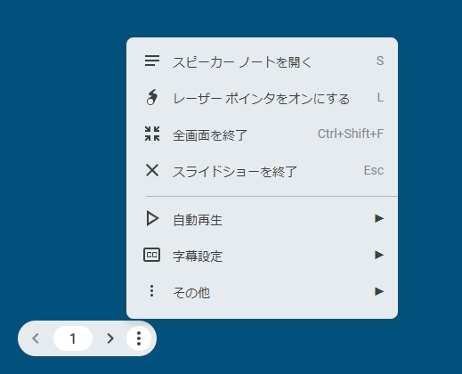

プレゼンテーションモードでマウスポインタをレーザーポインタ風の表示にできる

ショートカットキーだと`l`ボタンで切り替えが可能

ショートカット以外だと、左下のハンバーガーメニューからでも切り替え可能

蛇足だが、自分がいつも使っているスピーカーノートのショートカットも用意されていて`s`キーで表示切り替えを行える

- レーザーポインタ風表示

発表のときとか「ここです！」って示すのにレーザーポインタ風だとみやすい