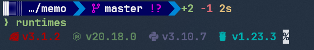

Dotfiles盆栽として、ansibleをいじったりzshの設定をいじったりしている

プロンプトもそろそろ変えようかなということで以前話題になっていたStarshipを入れてみた

特に難しいことはなかったのでただの作業ログ

zinitでインストールするようにした

## インストール設定

[zdharma-continuum/zinit: 🌻 Flexible and fast ZSH plugin manager](https://github.com/zdharma-continuum/zinit)

ここに設定方法が書いてある

Starshipについても記述があるのでこれ通りにするので良さそう


```shell
zinit ice as"command" from"gh-r" \
          atclone"./starship init zsh > init.zsh; ./starship completions zsh > _starship" \
          atpull"%atclone" src"init.zsh"
zinit light starship/starship
```

zinitは初回起動時に各種プラグインがなければインストールするという挙動にしている

Starthipは既存のツール管理に利用しているmiseで管理しようか迷ったがmiseにするとAnsibleとの組み合わせがそんなに良くないなと思ったのでzinitでインストールするようにした

とりあえずこれでシェル起動したらStarshipをインストールして適用してくれる

### zinitのplugin

インストールしたStarshipはどこにあるのか

気になったので見てみた

```
cd .zinit/plugins/starship---starship
init.zsh _starship starship*
```
ここにいろいろ入っているのね

zinitのプラグインごとにディレクトリ切ってある、`org---repo`っていう命名規則かな

[zdharma-continuum/zinit: 🌻 Flexible and fast ZSH plugin manager](https://github.com/zdharma-continuum/zinit?tab=readme-ov-file#more-examples)

てかこの例で、Pluginの中にfzfとかも入っていて、miseと同様zinitも開発に使うツール管理していく世界線を目指しているのか?と思った

### pluginの更新

まず現状を確認

- status

```
$ zinit status
Assuming --all is passed
Already up-to-date.
Note: status done also for unloaded plugins

Status for plugin agkozak/zhooks
On branch master
Your branch is up to date with 'origin/master'.

Status for plugin zsh-users/zsh-completions
On branch master
Your branch is up to date with 'origin/master'.

nothing to commit, working tree clean

Status for plugin zsh-users/zsh-syntax-highlighting
On branch master
Your branch is up to date with 'origin/master'.

nothing to commit, working tree clean
The update took 0.06 seconds
```

一部省略したがこのように現状の状態を表示してくれる

statusみたらほとんど`main`ブランチを参照していてワロタ…

バージョン管理っていうよりGitの最新を取ってくるって感じのよう

そして下記で更新できる

- update

```
$ zinit update
Assuming --all is passed
Already up-to-date.
Note: updating also unloaded plugins
Updating agkozak/zhooks
Updating sindresorhus/pure
Updating starship/starship
[gh-r] latest version (v1.21.1) already installed
Updating zdharma-continuum/z-a-as-monitor
Updating zdharma-continuum/z-a-bin-gem-node
Updating zdharma-continuum/z-a-patch-dl
Updating zsh-users/zsh-completions
2024-12-23 c160d09 Merge pull request #1116 from Mic92/typos
2024-12-22 59184db fix typos
2024-12-11 6ff1a67 Merge pull request #1115 from zsh-users/update_node
2024-12-11 3f00e7c Update node.js completion to version 23.4
2024-12-11 a169722 fix typos
2024-12-11 97804d9 Merge pull request #1114 from egorlem/diplodoc
2024-12-11 375d578 Update authors block
2024-12-11 bb6d6ba Update completion according to the help documents
2024-12-11 1ae4ab5 Remove needless configurations
2024-12-11 e7068f9 Set argument parameter to options that take an argument
2024-12-11 a9c9c72 Fix according to coding convention
2024-12-10 8f1b90c Add help argument
2024-12-10 b97fdbd Fix typo
2024-12-10 a0effab Remove unused file_types var
2024-12-10 1b16b6c Add completion script for yfm (diplodoc cli)
2024-11-26 874917f Merge pull request #1113 from kyanagi/update-rspec
2024-11-26 509d844 Update rspec completion
2024-11-20 f607e94 Merge pull request #1112 from hydrargyrum/age
2024-11-19 8d42717 Fix options that can be specified many times
2024-11-19 610aef9 Don't complete options when '--help' is specified
2024-11-19 692e96c Add format information
2024-11-19 360ee98 Fix comment
2024-11-19 6dec488 add completion for age
2024-11-17 df14fc4 Merge pull request #1111 from zsh-users/add-util-linux
2024-11-17 fdc290d Consider BSD distributions
2024-11-14 2c2d878 Consider macOS's uuidgen
2024-11-13 8f3baa3 Add lscpu completion
2024-11-12 c791de1 Add uuidgen
Updating 9df3345..c160d09
Fast-forward
==> Compiling zsh-completions.plugin.zsh [OK]
Updating zsh-users/zsh-syntax-highlighting
2024-11-21 5eb677b 'main' tests: Don't assume ps(1) is available.
Updating e0165ea..5eb677b
Fast-forward
==> Compiling zsh-syntax-highlighting.plugin.zsh [OK]
The update took 10.12 seconds
```

## Starshipのテーマ変更

特にこだわりがなければ下記のpresetから選んで設定ファイルとして特定ディレクトリに置けば良い

[Presets | Starship](https://starship.rs/presets/)

設定情報の出力は下記コマンドで

```
starship preset tokyo-night -o ~/.config/starship.toml
```

アイコンが表示されなかったので調べたらNERD FONTSの中から何かしらインストールする必要があるらしい

[Nerd Fonts - Iconic font aggregator, glyphs/icons collection, & fonts patcher](https://www.nerdfonts.com/font-downloads)

とりあえず適当にJetBrains Monoを入れた

で、WindowsTerminalの外観設定でNerdFontのフォントを設定した


表示された、あとは細かいところ調整かな

### 設定

プリセットをいくつか試したがしっくり来なかったのでカスタマイズする…

ここから沼が始まるきっかけになりうるので、できるだけ最小限にしたい…

#### icon

設定上にアイコンを入れることで表示にもアイコンを反映できる

[Nerd Fonts - Iconic font aggregator, glyphs/icons collection, & fonts patcher](https://www.nerdfonts.com/cheat-sheet)

これで検索しながら設定ファイルにコピーしていく感じかな…


### モジュール

[Configuration | Starship](https://starship.rs/config/)

結構な種類のモジュールがある

それぞれのモジュールで、どのようなフォーマットで表示するか?スタイルはどうするか?などの項目をそれぞれ指定する

ドキュメント全体をざっくり読んでみて良さそうなのを試してみるっていうのを繰り返した

最終的にコマンドの実行時間、コマンドのExitCode、Gitのステータス、差分の行数などを入れた

### config

いろいろあるが現時点の最終的な設定は次のようになっている

試行錯誤の過程で使わなくなったものも含まれている

```toml
"$schema" = 'https://starship.rs/config-schema.json'

format = """
[░▒▓](bg:color_fg0 fg:color_bg1)\
$directory\
[](fg:color_bg1 bg:color_bg3)\
[](fg:color_bg3 bg:color_bg1)\
$git_branch\
$git_status\
[](fg:color_bg1 bg:color_bg3)\
$docker_context\
[](fg:color_bg3)\
$git_metrics\
$status\
$cmd_duration\
$line_break$character"""

palette = 'custom'

[palettes.custom]
color_fg0 = '#eeeeee'
color_bg1 = '#00005f'
color_bg2 = '#090cb5'
color_bg3 = '#0074D9'
color_blue = '#3a6ab3'
color_aqua = '#8bb8f5'
color_green = '#3ff1b0'
color_orange = '#f13f5b'
color_purple = '#9f68c9'
color_red = '#b22b6b'
color_yellow = '#f3c13f'
color_accent = '#d700d7'

[os]
disabled = false
style = "bg:color_orange fg:color_fg0"

[os.symbols]
Windows = "󰍲"
Ubuntu = "󰕈"
SUSE = ""
Raspbian = "󰐿"
Mint = "󰣭"
Macos = "󰀵"
Manjaro = ""
Linux = "󰌽"
Gentoo = "󰣨"
Fedora = "󰣛"
Alpine = ""
Amazon = ""
Android = ""
Arch = "󰣇"
Artix = "󰣇"
EndeavourOS = ""
CentOS = ""
Debian = "󰣚"
Redhat = "󱄛"
RedHatEnterprise = "󱄛"
Pop = ""

[username]
show_always = true
style_user = "bg:color_orange fg:color_fg0"
style_root = "bg:color_orange fg:color_fg0"
format = '[ $user ]($style)'

[directory]
style = "fg:color_fg0 bg:color_bg1"
format = "[ $path ]($style)"
truncation_length = 3
truncation_symbol = "…/"

[directory.substitutions]
"Documents" = "󰈙 "
"Downloads" = " "
"Music" = "󰝚 "
"Pictures" = " "
"Developer" = "󰲋 "

[git_branch]
symbol = "[](fg:color_accent bg:color_bg1)"
style = "bg:color_aqua"
format = '[[ $symbol $branch ](fg:color_fg0 bg:color_bg1)]($style)'

[git_status]
style = "bg:color_aqua"
format = '[[($all_status$ahead_behind )](fg:color_accent bg:color_bg1)]($style)'

[git_metrics]
disabled = false

[nodejs]
symbol = ""
style = "fg:#3c873a"
format = '[ $symbol( $version) ]($style)'

[rust]
symbol = ""
style = "bg:color_blue"
format = '[[ $symbol( $version) ](fg:color_fg0 bg:color_blue)]($style)'

[golang]
symbol = ""
style = "fg:#29beb0"
format = '[ $symbol( $version) ]($style)'

[python]
symbol = ""
style = "fg:#306998"
format = '[ $symbol( $version) ]($style)'

[ruby]
symbol = ""
style = "fg:#a91401"
format = '[ $symbol( $version) ]($style)'

[docker_context]
symbol = ""
style = "bg:color_bg3"
format = '[[ $symbol( $context) ](fg:#83a598 bg:color_bg3)]($style)'

[time]
disabled = false
time_format = "%R"
style = "bg:color_bg1"
format = '[[  $time ](fg:color_fg0 bg:color_bg1)]($style)'

[line_break]
disabled = false

[character]
disabled = false
success_symbol = '[❯](bold fg:green)'
error_symbol = '[❯](bold fg:red)'
vimcmd_symbol = '[❯](bold fg:green)'
vimcmd_replace_one_symbol = '[❯](bold fg:purple)'
vimcmd_replace_symbol = '[❯](bold fg:purple)'
vimcmd_visual_symbol = '[❯](bold fg:yellow)'

[status]
symbol = ' '
pipestatus = true
disabled = false
map_symbol = false

[cmd_duration]
format = '[$duration]($style)'
min_time = 1000
```

結局かなり長くなってしまった

見た目はこんな感じ


## 各種言語のランタイム

蛇足

最初は設定して表示するようにしてたがなんかしっくり来なかったのと常に表示しておく必要ないよねということで消した

代わりに次のようなコマンドを用意し実行したら現在のディレクトリでの言語ランタイムのバージョンが分かるようにした

- bin/runtimes

```
#!/bin/sh

starship module ruby; starship module nodejs; starship module python; starship module golang;
```



