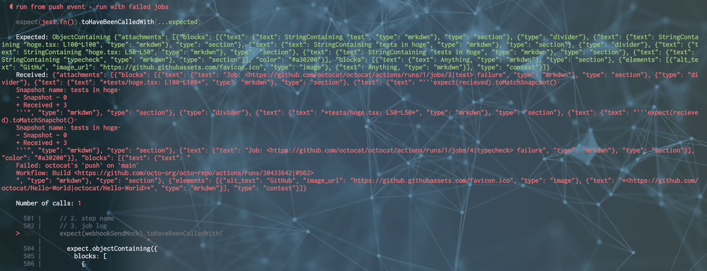

- バージョン

```
@slack/webhook@7.0.2
jest@29.7.0
```

`@slack/webhook`を用いてWebhook経由のSlack通知を実装した際のテストコードの話

`send`メソッドがどんな引数で呼ばれたかをチェックする

- アプリケーションコード

```typescript
import {
  IncomingWebhook,
  IncomingWebhookResult,
  IncomingWebhookSendArguments
} from '@slack/webhook'

export async function notify(
  webhookUrl: string,
  params: IncomingWebhookSendArguments
): Promise<IncomingWebhookResult> {
  const webhook = new IncomingWebhook(webhookUrl)

  return await webhook.send(params)
}
```

- テストコード

```typescript
  let webhookSendMock

  beforeEach(() => {
    webhookSendMock = jest.spyOn(IncomingWebhook.prototype, 'send').mockImplementation((params): Promise<IncomingWebhookResult> => Promise.resolve({text: 'ok'}))
  })

  it('run', () => {
    await main.run() // mainからアプリケーションコードを呼んでいる

    expect(webhookSendMock).toHaveBeenCalledWith(expect.objectContaining({
      text: expect.stringContaining('Workflow: test-workflow'),
      blocks: expect.anything()
    }))
  })
```

こんな感じで、引数の検証とレスポンスのモック両方行える

mswでもSlackへの通信をモックしてたが、`spyOn`によって上書きされるので、レスポンスを返すところまで`mockImplementation`で書いてあげる必要がある

使う側からみると`new IncomingWebhook`して返ってきたインスタンスをモックするにはどうすればよいのかと思ってたけど、prototypeを指定すればよいのね

たしかに、納得

## やっていること

`toHaveBeenCalledWith`で呼ばれた際の引数のチェックを行える

- [toHaveBeenCalledWith](https://jestjs.io/ja/docs/expect#tohavebeencalledwitharg1-arg2-)

`expect.objectContaining`で再帰的に受け取ったオブジェクトの中身をチェックできる

- [objectContaining](https://jestjs.io/ja/docs/expect#expectobjectcontainingobject)

中身の指定は固定の値や`expect.anything`、`expect.stringContaining`などのマッチャも指定できる

`expect.stringContaining()`や`expect.anything()`を用いることで部分一致や特定のキー以下は何でもよいというようなチェックができる

- [stringContaining](https://jestjs.io/ja/docs/expect#expectstringcontainingstring)
- [anything](https://jestjs.io/ja/docs/expect#expectanything)

今回の場合下記のようなパラメータで`send`メソッドにパラメータを送っている

```javascript
{
  text: "Workflow: test-workflow",
  blocks: [${色々…}]
}
```

他にも`Containing`系のマッチャはあるので場面によって使い分けする

ここだけは担保しておきたいというような場合にも検証ができるのとネストした場所でも使用できるので便利

## テスト失敗時の差分表示

`toHaveBeenCalledWith`,`objectContaining`を用いたテストだと、差分があったときのdiff表示がprettyな表示にならないようで



検証対象の量が多いとどこに差分があるか探すのがつらくなってくる

一方この手の確認で有用なのはSnapshotテストが挙げられる

Snapshotテストは差分があった場合prettyな表示をしてくれるのでどこで差分があったか把握しやすい

なのでそもそも引数のオブジェクトのデータ量が多い場合はSnapshotテストに変更したほうが体験はよい

Snapshotテストだと基本的にはオブジェクトの中身すべて完全一致している必要があるので、このあたりもケースによって使い分けが必要