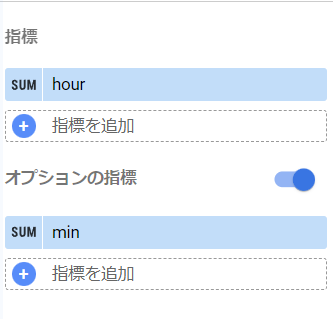
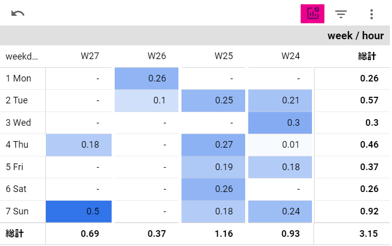
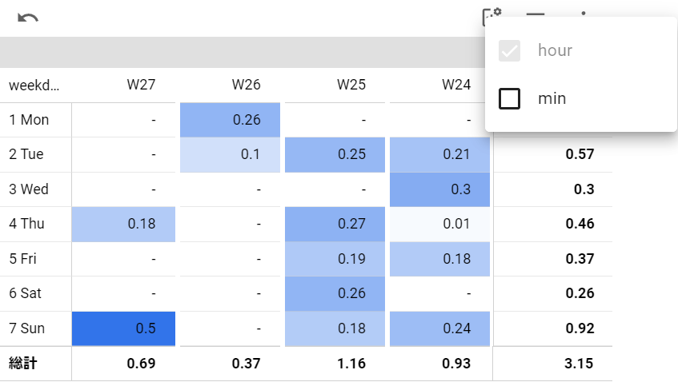
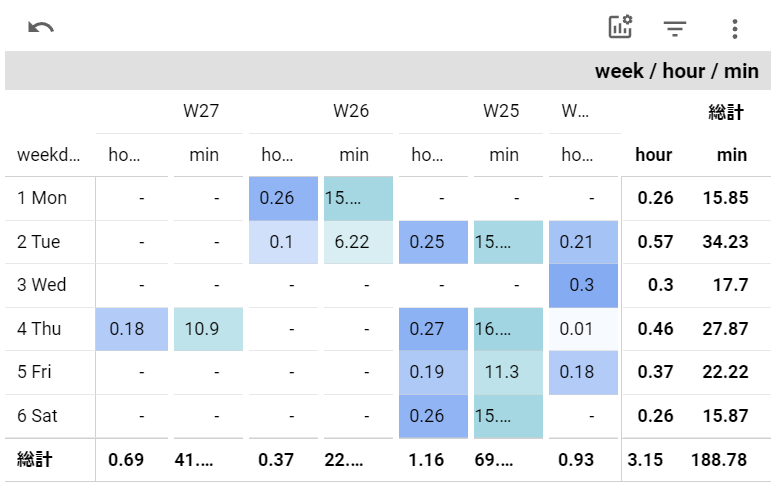
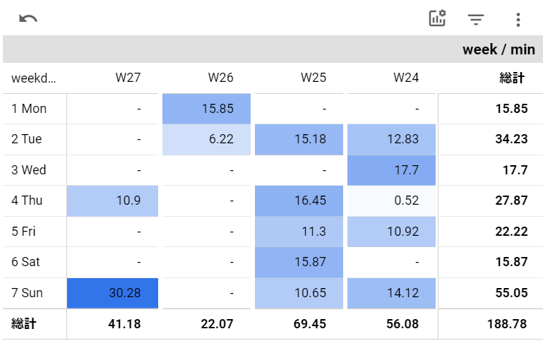

<!-- textlint-disable ja-technical-writing/ja-no-weak-phrase -->
最近またLookerStudioで頻繁にダッシュボードをいじることが増えて発見してよいなと思った機能
<!-- textlint-enable ja-technical-writing/ja-no-weak-phrase -->

`オプション指標`という設定がほぼどのグラフにもついていて、通常表示する指標のほかにプラスで指定できるというもの

グラフの種類によっては複数選択可能になっている（単一指標しか選択できないグラフもある）

## 設定箇所

たとえば、Togglの作業記録を取っていて可視化した場合に、分と時間という異なる単位の指標を切り分ける

<!-- textlint-disable prh -->
## 週と曜日のピボットテーブルでの作業時間
<!-- textlint-enable prh -->

### 時間で表示

読書時間をフィルタした結果

1未満が多くしっくり来ない…

ハイライト部分をクリックすると設定で指定した指標が選べる

### 複数表示

### 分のみ表示

あまり多くないので分表示のほうがしっくり頭に入ってくる

逆に大まかな分類の場合は時間での表示のほうが頭に入ってきやすい

他にも時系列グラフでも指定可能なのでバリエーションは結構広がる
