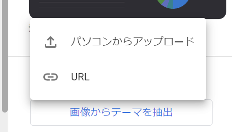
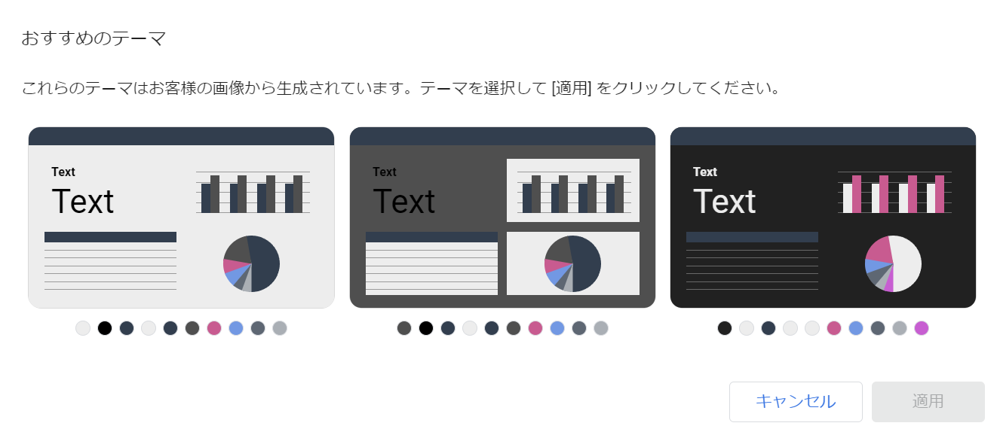
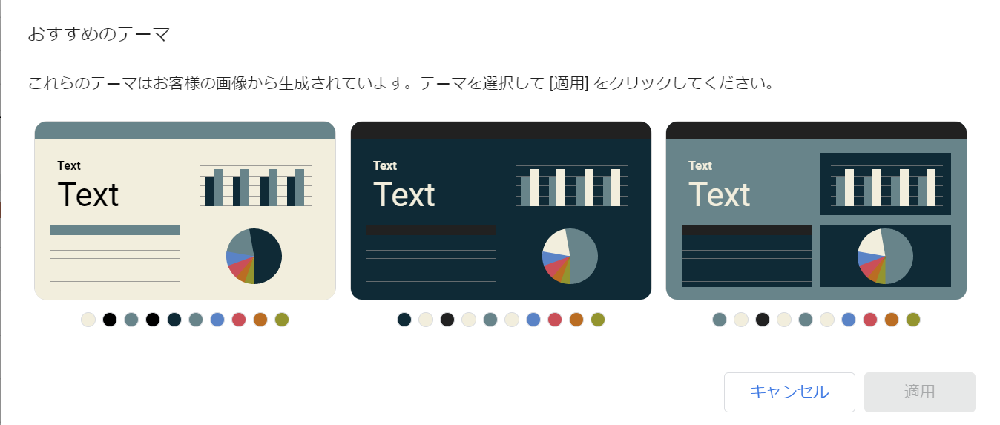

「テーマとレイアウト」の一番下

ここから画像を読ませると、読ませた画像にあったテーマを生成してくれる

試しに下記スクショを保存してアップロードしてみた

提案されたテーマは下記

雰囲気はある

エディタとかターミナルのテーマのカラーパレットを上げたら良い感じになるんじゃないかな

試しにSolarized darkのパレットを探して上げてみた

ベースとなるテーマを画像から生成して細かいところは自分で調整も可能

自分の好きな色合いをとりあえず集めてアップロード、細かいところは自分で調整するだけでカスタマイズしたカラーテーマにできる

良い
