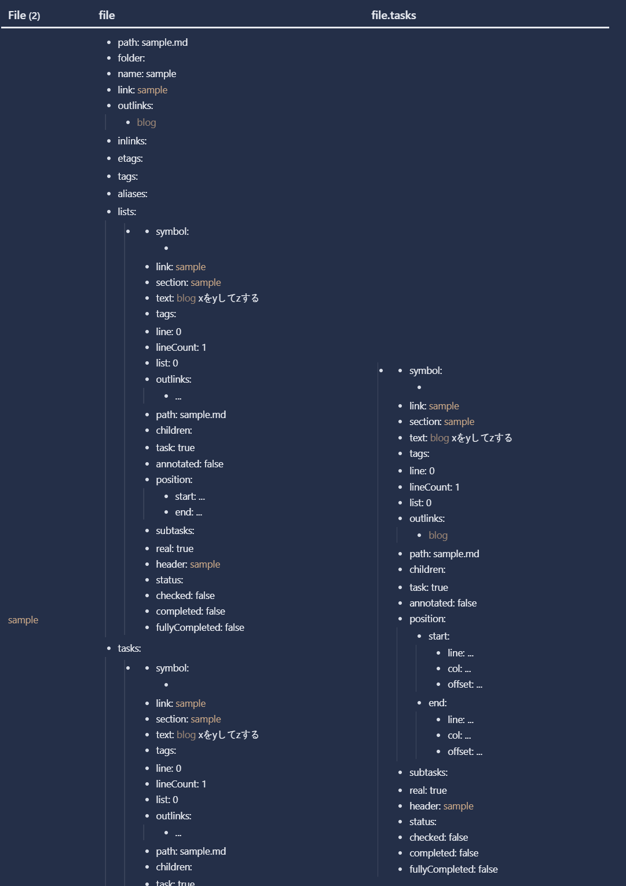
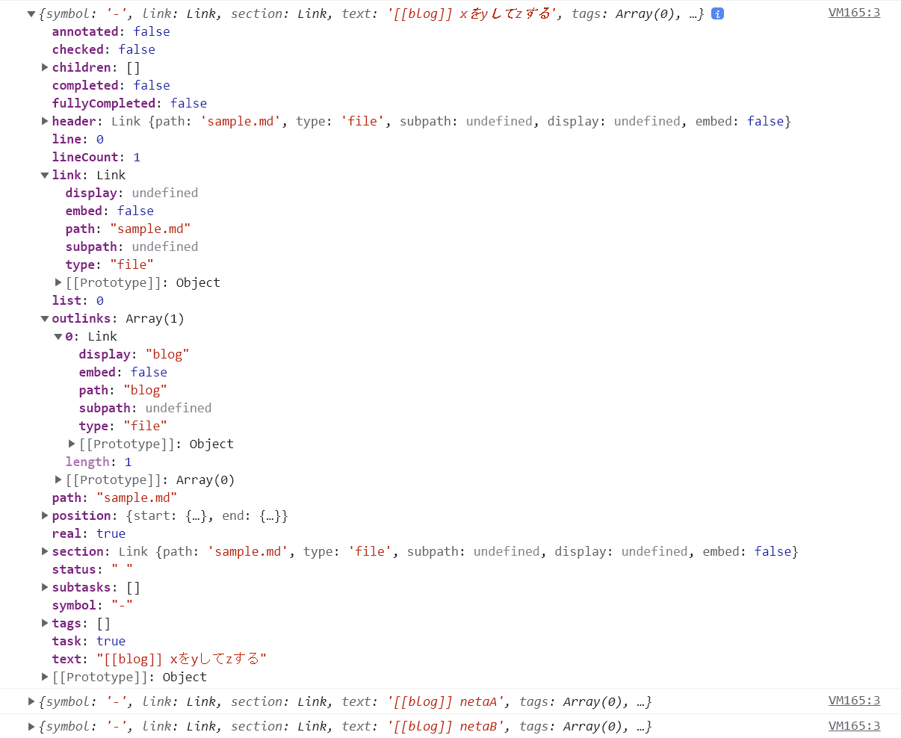
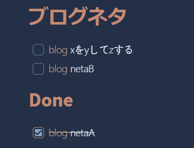

Obsidianでメモを残し始めている

技術的な内容のメモを書いていると「これはブログネタになるかも」みたいなのが湧いてくることがある

そういう時にさっと内部リンクをつけてメモを残しておく+その内容をまとめてどこかで閲覧できると良いなと思ったのでDataviewプラグインでやってみた

## Dataviewプラグイン

[Dataview](https://blacksmithgu.github.io/obsidian-dataview/)

記事のfrontmatterやタグ、ディレクトリなどの情報をもとにテーブル表示してくれるプラグイン

コードブロックに`dataview`を指定することで表示してくれる

クエリはSQLライクな書き方で問い合わせする

FROMにはページのリストの単位、特定のタグやディレクトリなどを指定する

条件などにファイルの更新日、ファイル名などファイルのメタデータも含められるためある程度なんでもできそう

またSQLライクな書き方以外にもJavaScriptを書くこともできる

その場合はコードブロックに`dataviewjs`を指定する

## ブログネタのリストをタスクリストとして表示させる

サンプル用に次のようなメモを用意した

- 2022-11-29.md

```
## ToDo
- [x] [[blog]] netaA
- [ ] [[blog]] netaB
- [ ] netaC
```

- sample.md

```
- [ ] [[blog]] xをyしてzする
```


- コードブロックの中身

```javascript
dv.taskList(dv.pages("[[blog]]").sort(p => dv.date(p.file.ctime), 'desc').file.tasks.where(t => !t.completed && t.outlinks.some((l) => l.display == 'blog')), false);
```

- `dv.pages`で`[[blog]]`の内部リンクが存在するページを取得
- 最新のファイルから走査するようにソート
- `file.tasks.where`でチェックボックスのリストから特定条件のタスクを取得
    - 未チェック
    - `file.outlinks`の中から`display`プロパティが`blog`なタスクをチェックする
- `dv.taskList`は第2引数でページごとにグループ化するかどうかのオプションを渡せる（defaultは`true`）、`false`を渡すと単純にページをまたいでまとめたリストとして表示できる

### fileオブジェクトの中身

確かプラグインのドキュメントにも乗っていた気がするが確かめながらでもできる

こんな感じのクエリを書くと

```dataview
TABLE
file.tasks
FROM [[blog]]
SORT file.ctime DESC
```



このようにオブジェクトの中身を表示できる

もしくは、`dataviewjs`のコードブロックのJavaScript中に`console.log()`を仕込み、DeveloperToolsでオブジェクトの中身を覗くことができる

```javascript
dv.taskList(
  dv.pages("[[blog]]").sort(p => dv.date(p.file.ctime), 'desc').file.tasks.where(t => {
  console.log(t);
  return !t.completed && t.outlinks.some(l => l.display == 'blog')
}), false);
```



こんな感じで中身見ながらやるとある程度クエリが書けるようになる気がする


## 表示

ほぼ同じクエリで`t.completed`に条件を変えた（チェックした）リストも追加するとこんな感じで表示できる


