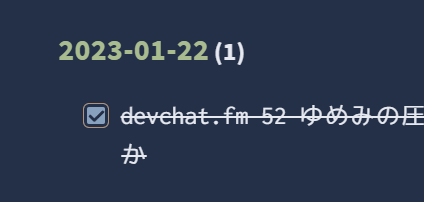

## 前提

- デイリーノートを`daily_note`ディレクトリ以下に保存している
- ポッドキャストを聞いたら、途中でも`## Podcast`というヘッダ以下にタスクリストを書くようにしている


で、今回は聞き終わったタスクリストを表示したい

特定ヘッダ以下のタスクリストなんて出せるのか?と思っていたができるよう

## taskリスト

```dataview
TASK
FROM "daily_note"
WHERE contains(meta(section).subpath, "Podcast")
AND completed
AND file.cday.day > this.file.cday.day - 50
GROUP BY file.name
```

- 結果



### 特定ヘッダ以下のタスクリストを取得する

[Filtering tasks by heading in dataview - Help - Obsidian Forum](https://forum.obsidian.md/t/filtering-tasks-by-heading-in-dataview/50915/4)

`meta`を挟むことで判定できるようになる

[Functions - Dataview](https://blacksmithgu.github.io/obsidian-dataview/reference/functions/#metalinksubpath)

ドキュメントでは`link`に対して使っているが`section`に対しても使える

「自身のプロパティへアクセスしたい場合にmetaを使う」と書いてあった

活用方法はいろいろありそう

### 直近○日とかの範囲でフィルタする

[Dataview list based on PREVIOUS month - Resolved help - Obsidian Forum](https://forum.obsidian.md/t/dataview-list-based-on-previous-month/23213/7)

比較対象にする値は`this`でそのファイルの値から-○日とかそういう書き方が必要

`this`を入れるのがポイントっぽい

`day`の他にも`file.cday.month`や`file.cday.year`もある

JavaScript書かずに済ませられたので良かった