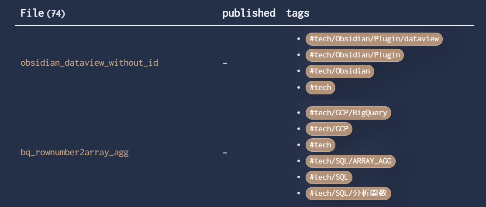
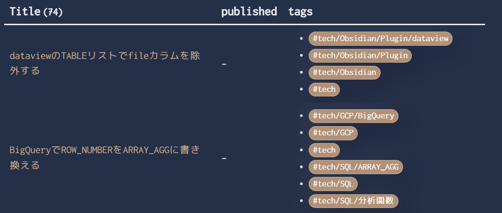

とりあえず何かしらのノートたちを`TABLE`を使ってリストを出力させてみようという感じでやるとこんな感じ

```
TABLE
published,
file.tags AS tags
FROM "tech"
SORT file.mtime DESC
```



特にカラム指定せずとも`file`に関しては表示された状態になっている

なんとなくファイル名に日本語を含めるのに抵抗があるので、できればfrontmatterに`title`を別で用意してそいつを参照させるようにしたい（もちろんノートへのリンクもつけておきたい）

## Markdownファイルの前提

今回扱うノートにはすべてfrontmatterを書いている

```markdown
---
title: dataviewのTABLEリストでfileカラムを除外する
tags:
- tech/Obsidian/Plugin/dataview
---
```

こんな感じ、そしてリンクにするのをファイル名ではなく`title`にしたい

## fileの除外

`WITHOUT ID`で除外できる

これはIDがこの場合は`file`という扱いってことなのかな（詳しく追ってはいない）

```
TABLE WITHOUT ID
link(file.link, title) AS "Title",
published,
file.tags AS tags
FROM "tech"
SORT file.mtime DESC
```

2行目、代替となるカラムを用意する(`Title`)

`link`でリンク表示にできる、表示する文字列をfrontmatterの`title`にする

求めている感じになってきた



## おわり

Obsidianのdataviewプラグインに関してはやりたいことを単語で探すとIssueにたどり着いてたいていのやりたいことは解決策が書いてあるので助かる…

- 参考
[Omit "File" column in TABLE results · Issue #102 · blacksmithgu/obsidian-dataview](https://github.com/blacksmithgu/obsidian-dataview/issues/102)
