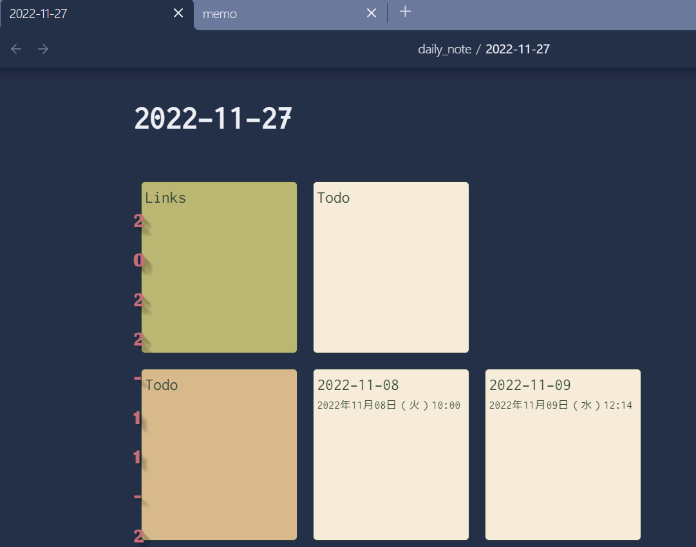
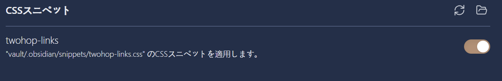
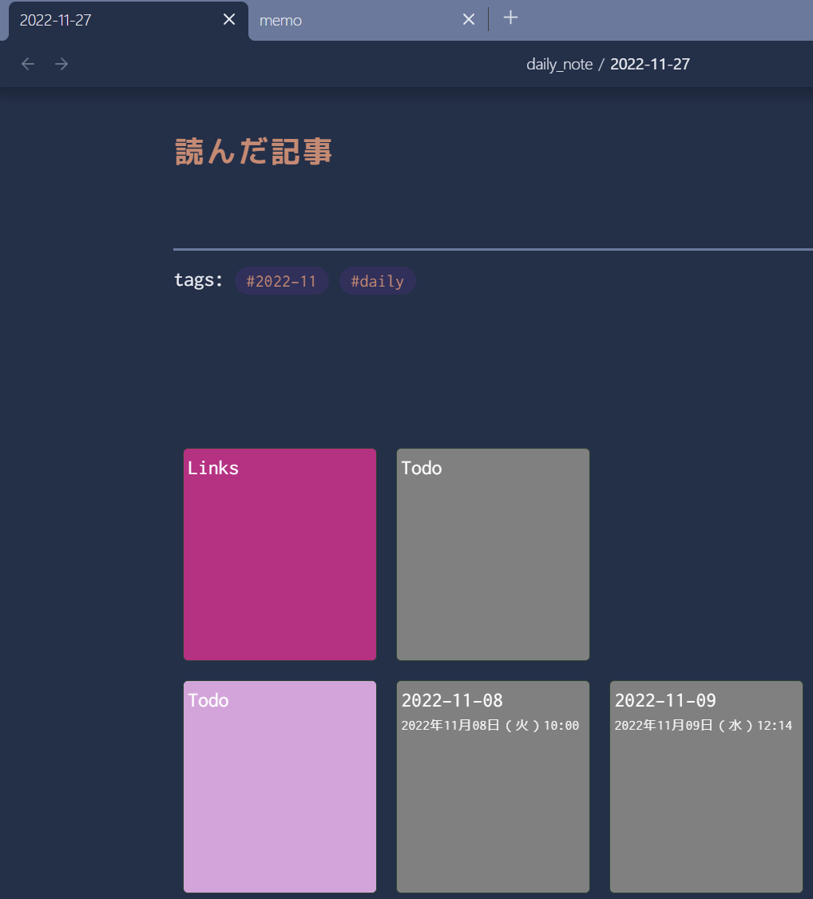

2ホップリンクっていうのを入れてみたかったのでプラグインを入れた

[tokuhirom/obsidian-2hop-links-plugin](https://github.com/tokuhirom/obsidian-2hop-links-plugin)

が、編集画面でレイアウト崩れが起きてしまっていた

- 環境

```
Obsidian Version: v1.0.3
OS: Windows
Plugin Version: 0.9.0
```



ということで無理やりだがCSSスニペットで上書きしてなんとかしてみた

- .obsidian/snippets/twohop-links.css

```css
/* カード */
.twohop-links-box {
  color: white;
  background-color: gray;
}

.twohop-links-tag-header {
  color: white;
  background-color: plum;
}

.twohop-links-back-links .twohop-links-connected-links-header {
  color: white;
  background-color: orchid;
}

.twohop-links-forward-links .twohop-links-connected-links-header {
  color: white;
  background-color: mediumvioletred;
}

.twohop-links-resolved .twohop-links-twohop-header {
  color: white;
  background-color: plum;
}

/* プレビューのテキスト */
.twohop-links-box-preview {
  color: whitesmoke;
}

/* 編集モードでレイアウトが崩れてしまうので直接書き換え */
.markdown-source-view.mod-cm6 .cm-content {
  width: 100%;
}
.markdown-source-view.mod-cm6 .cm-contentContainer {
  display: flex;
  overflow-x: visible;
  flex-direction: column;
}
```

- 適用




せっかくなのでカードの色も個人の好みに変えた

- 適用後




