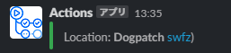

忘れるので備忘録

[Formatting text for app surfaces | Slack](https://api.slack.com/reference/surfaces/formatting#linking_to_urls)

SlackのAPI経由でtextを生成において、Markdown記法が使えるもののリンクなどは独自の記法になっている

`<url|文字列>`という感じ

```json
"blocks": [
  {
    "type": "context",
    "elements": [
      {
        "type": "mrkdwn",
        "text": "Location: *Dogpatch* <https://github.com/swfz|swfz>)"
      }
    ]
  }
]
```

めちゃめちゃ細かい話だがスペースとかが入ると変換してくれない

## 失敗パターン

```
< https://github.com/swfz | swfz>
```


## 成功パターン

```
<https://github.com/swfz | swfz>
```

