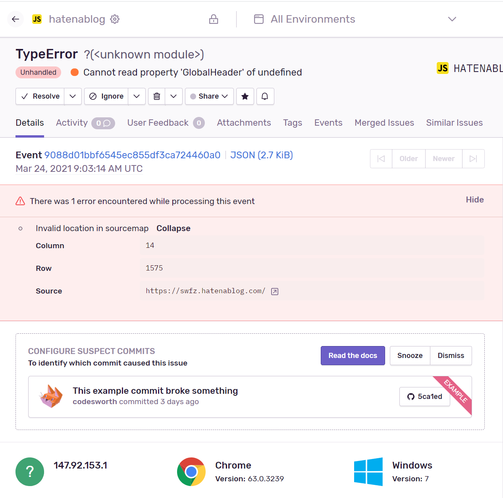

これで一発OKだった

[Lazy-Loading Sentry for JavaScript | Sentry Documentation](https://docs.sentry.io/platforms/javascript/install/lazy-load-sentry/)

CDNへのリンクを`カスタマイズ`から`フッター`でタグなどを入力できる箇所で入力するだけ

しばらく放置してたらイベントが発生した

まぁだからといって何ができるというわけではないのだが…
