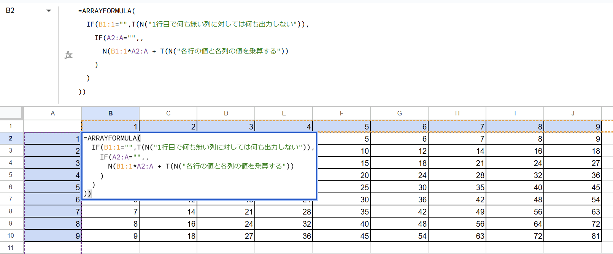

<!-- textlint-disable ja-technical-writing/sentence-length -->
あるていど定期的には使うが、データの公開範囲をコントロールしたいとか、BigQueryなどのサービスにデータを入れてまでやるほどではない簡単な集計や分析などでは、スプレッドシートに関数をいろいろ書いて済ませてしまうことがよくある
<!-- textlint-enable ja-technical-writing/sentence-length -->

そもそも読めないほど複雑になるのであればGASなりスクリプトなりでコード書いて処理したほうがよい場合もあるが…

コメント機能があるといくらか楽になるなーって場面に結構遭遇しているのでそういう機能がないかちょっと調べたら見つかった

[T - Google ドキュメント エディタ ヘルプ](https://support.google.com/docs/answer/3094138?hl=ja)

[N - Google ドキュメント エディタ ヘルプ](https://support.google.com/docs/answer/3093357?hl=ja)

2つを組み合わせることでコメント的なもの（セルの内容に影響を与えず、メモ的な感じ）を残すことが可能になる

## 例

```
=SUM(A1:A)&T(N("A列の値をすべて足した値"))
```
各関数の詳細な挙動はドキュメントを読むのが一番良いがポイントだけピックアップすると

- `N`は指定された引数を数値として返すが、文字列を渡すと`0`を返す
- `T`は指定された引数をテキストとして返すが、`0`などの数字を渡すと何もない空白を返す、`FALSE`などの真偽値でも空白を返す

この2つの特性を利用する

これらの関数を組み合わせ、本来の計算結果と結合させてしまえば特にセルの内容には影響なくテキストを残すことが可能になる

複数行に渡る関数の組み合わせの処理を書いたりした場合など、行末にこれらを結合させておけばそれこそコメントっぽくなる

かなり便利！

## もう少し複雑な例



結果が数値を期待する箇所では、コメント処理を結合させてしまうと文字列として扱われてしまうため、見た目が数値用の右寄せから左寄せになってしまったりするので注意が必要

## おわり

スプレッドシート内で配列処理とかを書いていると「あれ?この列はFだっけ?Gだっけ?」など座標と文字列や数字をマッピングさせるのがいちいちたいへんで読むたびに脳内で変換処理を入れるのでかなり時間を使う

<!-- textlint-disable ja-technical-writing/sentence-length -->
ある程度定型な処理であれば名前付き関数を用意してわかりやすいように定義してしまうのもありだが、やはりその場にコメントとして「この処理はこの列（◯◯の数値）を△している」というのが残っているだけでかなり負担が減る
<!-- textlint-enable ja-technical-writing/sentence-length -->

まぁ、コメントと実態が乖離しているとまたそれはそれでたいへんなので適切な用法用量で使うのが良さそう
