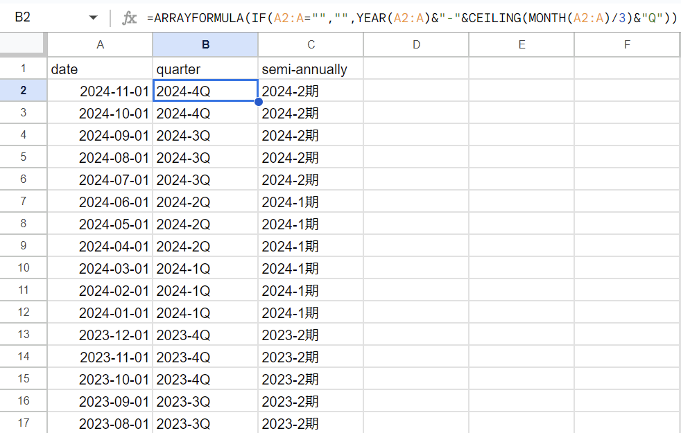

Qごとや半期ごとに集計するみたいな際、日付情報からその日のQや上期、下期みたいなのを出力させる

## Qごと

```
=ARRAYFORMULA(IF(A2:A="","",YEAR(A2:A)&"-"&CEILING(MONTH(A2:A)/3)&"Q"))
```

## 半期ごと

```
=ARRAYFORMULA(IF(A2:A="","",YEAR(A2:A)&"-"&CEILING(MONTH(A2:A)/6)&"期"))
```

`1`が上期、`2`が下期

## イメージ



