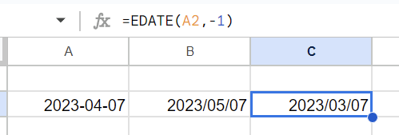

どうやるんだろうと調べたら`EDATE`という月計算をするための関数があった

[EDATE - Google ドキュメント エディタ ヘルプ](https://support.google.com/docs/answer/3092974?hl=ja)

こんな感じ

他にもあるんだろうかと調べてみたら月末日を算出する関数もあった

[EOMONTH - Google ドキュメント エディタ ヘルプ](https://support.google.com/docs/answer/3093044?hl=ja)

プログラムだと結構月末日出したいっていうパターンはよくあるがSpreadsheetだとあんまり機会がないかも

とはいえ両方めちゃくちゃはかどる