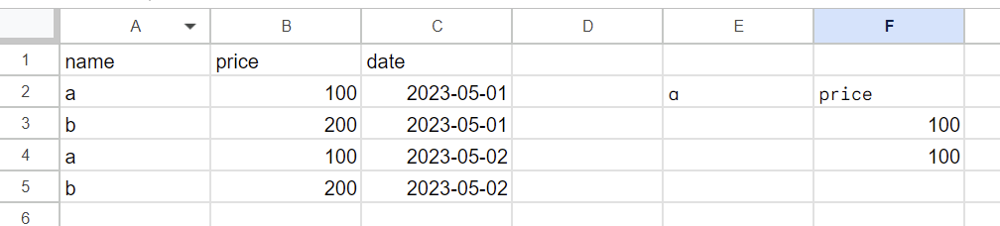
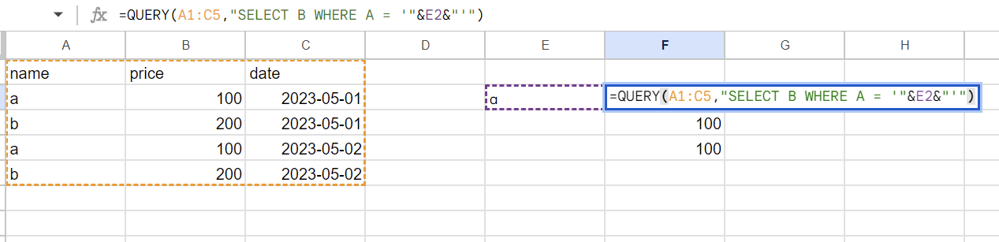
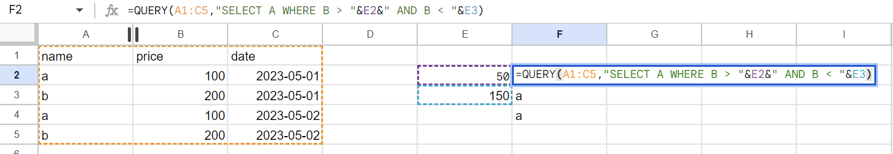
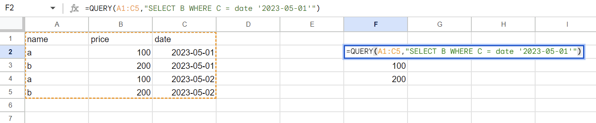
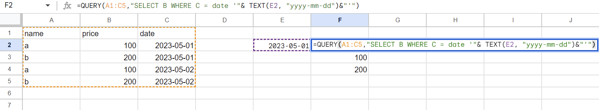

いつも忘れるのでメモ

QUERYでシート内のセルの値を使うときのパターンいくつか

## 普通の文字列が対象

```
=QUERY(A1:C5,"SELECT B WHERE A = '"&E2&"'")
```





固定(`$`)も使える

## 数値が対象

```
=QUERY(A1:C5,"SELECT A WHERE B > "&E2&" AND B < "&E3)
```



条件が最後に来る場合は`&`でセル指定するだけで良い

これを見るとセル指定の後の`&`は`"`をエスケープするための記述っていうことが分かる

## 日付が対象
### 単純な固定値として日付をQUERYする

```
=QUERY(A1:C5,"SELECT B WHERE C = date '2023-05-01'")
```



### 日付のセルを指定してQUERYで使う

一度テキストで特定フォーマットにしてからQUERY内の`date`で日付ですよと教えてあげる必要がある

```
=QUERY(A1:C5,"SELECT B WHERE C = date '"& TEXT(E2, "yyyy-mm-dd")&"'")
```



どうしてもクオートとかガンガン出てくるので覚えられない