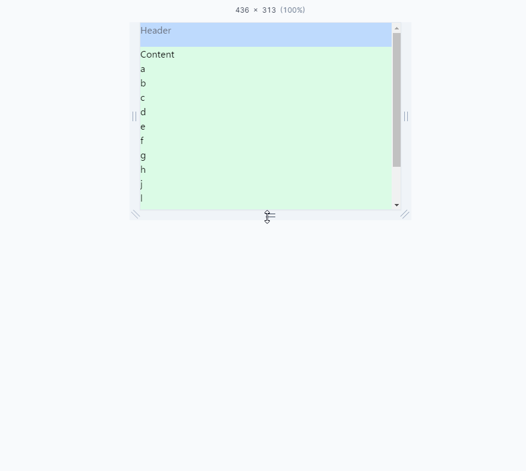

どうやるんだって調べたシリーズ

header,contents,footerとあった場合に画面の縦幅に対しcontentsが少なかった場合でもfooterを画面の一番下に表示させたい

中央のボディセクションが動的に伸縮してコンテンツの量に応じてサイズが変わる状態

## デモ



- 実際のコード

```html
<div class="flex min-h-screen flex-col justify-between bg-gray-100">
  <div class="h-10 bg-blue-200 text-gray-500">Header</div>
  <div class="grow bg-green-100">
    <div>Content</div>
    <div>a</div>
    <div>b</div>
    <div>c</div>
    <div>d</div>
    <div>e</div>
    <div>f</div>
    <div>g</div>
    <div>h</div>
    <div>j</div>
    <div>l</div>
    <div>m</div>
    <div>n</div>
  </div>
  <div class="h-10 bg-blue-200 text-gray-500">Footer</div>
</div>
```

## 各クラスの処理

- flex-col

Flexboxの子要素を縦列に配置

- justify-between

子要素をコンテナの縦方向の始端と終端に配置（上下）

- min-h-screen

コンテナの最小の高さをビューポートの高さにする

- grow

余白のあるスペースをすべて埋めるために拡大

これにより、headerとfooterの間の残りのスペースを占有

Contentsの内容が少なかったとしても`grow`を指定したItemスペースを専有する

## Playground

[Tailwind Play](https://play.tailwindcss.com/bbIqEGk7jD?size=820x580)
