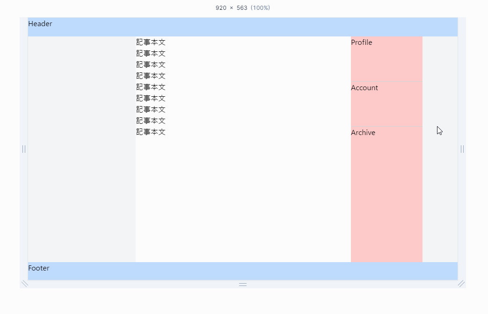

本ブログのスタイルをTailwindCSSへ差し替えるついでにモバイル対応的なものもやることにした

以前は若干崩れているところがあり正直なにも対応してなかったのでこれを機に対応した

構成はheader、メインコンテンツ（記事本文とサイドバー）、そしてfooterの3つの主要セクションから成り立っている

メインコンテンツのレイアウトが、画面のサイズ（特に、中間のブレークポイントであるmd）に応じて変化するようになっている

具体的には、小さい画面ではメインコンテンツが縦に積み重なり、大きい画面では横並びになるように設定した

## デモ



- 実際のコード

```html
<div class="flex min-h-screen flex-col justify-between bg-gray-100">
  <div class="h-10 bg-blue-200">Header</div>
  <div class="bg-gray-200 flex grow flex-col md:flex-row">
    <div class="basis-0 md:basis-3/12"></div>
    <div class="basis-6/12 bg-white border-b-4 md:border-0 border-zinc-100">
      <div>記事本文</div>
      <div>記事本文</div>
      <div>記事本文</div>
      <div>記事本文</div>
      <div>記事本文</div>
      <div>記事本文</div>
      <div>記事本文</div>
      <div>記事本文</div>
      <div>記事本文</div>
    </div>

    <div class="basis-2/12 divide-y divide-gray-300 bg-white md:bg-red-200">
      <div class="h-24">
        Profile
      </div>
      <div class="h-24">
        Account
      </div>
      <div class="h-32">
        Archive
      </div>
    </div>
  </div>
  <div class="h-10 bg-blue-200">Footer</div>
</div>
```

細かい指定はこのコードからさらに追加しているがおおむねこの通りにした

こちらで大枠は説明済み

### メインコンテンツ

- flex-col md:flex-row

モバイルでは縦並び、mdブレークポイント以上では横並び

- grow

余白のあるスペースをすべて埋めるために拡大

メインの記事のコンテンツ量が少ない場合にこれを指定しないとheader,footerとの間に隙間が空いてしまう

### メインコンテンツ内の左側の余白

- basis-0 md:basis-3/12

モバイルでは基本的に幅を取らず、mdブレークポイント以上では全体の3分の1の幅

### インコンテンツ内の中央の記事本文

- basis-6/12

全体の半分の幅

- border-b-4 md:border-0 border-zinc-100

画面サイズが小さい場合には記事本文セクションの下に境界線を表示

画面が大きい場合には境界線は表示されない

これにより、異なる画面サイズでの視覚的な区別が付きやすいようにしている

### メインコンテンツ内の右側のサイドバー

- divide-y divide-gray-300

縦に区切り線を入れ、線の色を薄いグレーに設定

子要素の間に線を入れてくれる、今まで専用のコンポーネント作ってたがクラス名指定するだけでよいのめちゃ楽

## Playground

[Tailwind Play](https://play.tailwindcss.com/FJeX8sOhMD?size=1338x625)
