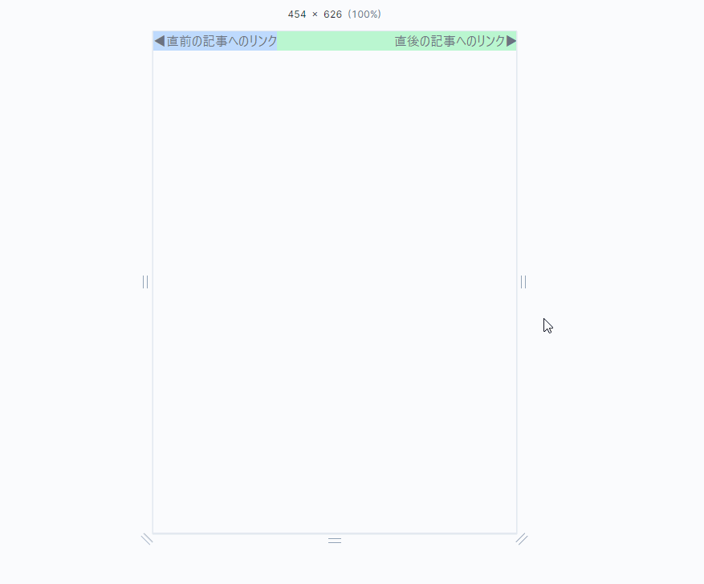

TailwindCSSでどうやるんだって調べたシリーズ

ブログサイトで直前直後の記事へのリンクを用意するパターン

画面サイズが十分に大きい場合は、リンクが一行に両端へ配置

画面が狭くなるとリンクが折り返されて上下に配置される

ただし、文字列の位置は左右に寄せる状態を維持

## デモ



- 実際のコード

```html
<div class="flex flex-row flex-wrap justify-between bg-gray-100">
  <div class="bg-blue-200 text-gray-500">◀直前の記事へのリンク</div>
  <div class="grow bg-green-200 text-right text-gray-500">直後の記事へのリンク▶</div>
</div>
```

## 各クラスの処理

- flex-row

子要素を水平方向に並べる

- flex-wrap

子要素がコンテナをオーバーフローする際に、新しい行に折り返す

- justify-between

子要素をコンテナの両端に配置

- grow

要素が利用可能な追加のスペースを取る

これにより、右の要素が余分なスペースを埋める

- text-right

要素内のテキストを右そろえ

## Playground

[Tailwind Play](https://play.tailwindcss.com/Fjx2LMKH5h?size=338x626)