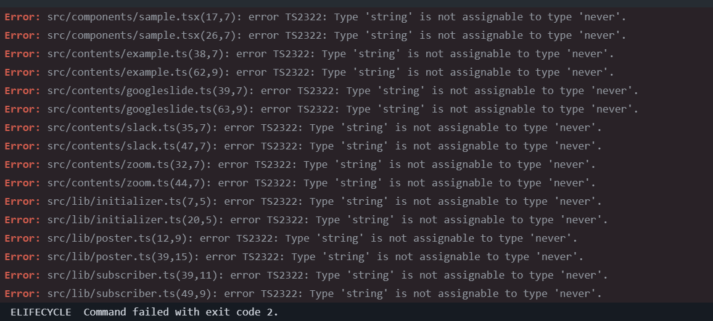

Plasmo使ってCrome拡張を開発している時の話

CIで型チェックを入れたらCIだと落ちるがローカルだと通る状態になっていた

- 型チェックのコマンド

```bash
tsc --noEmit
```



- 一部抜粋

```
Error: src/components/sample.tsx(17,7): error TS2322: Type 'string' is not assignable to type 'never'.
```

すべて`sendToBackground`の引数で`name`を指定している部分

最初全然意味がわからなかったがいろいろみていったら納得行くまでには落とし込めたのでメモ

## tsconfig.json

これはどこかの記事から引っ張ってきたやつだったはず…

```json
{
  "extends": "plasmo/templates/tsconfig.base",
  "exclude": ["node_modules"],
  "include": [".plasmo/index.d.ts", "./**/*.ts", "./**/*.tsx"],
  "compilerOptions": {
    "jsx": "react-jsx",
    "strict": true,
    "forceConsistentCasingInFileNames": true,
    "noUnusedLocals": true,
    "noUnusedParameters": true,
    "isolatedModules": true,
    "verbatimModuleSyntax": false,
    "noUncheckedIndexedAccess": true,
    "paths": {
      "~*": ["./*"]
    },
    "baseUrl": "."
  }
}
```

よく見ると、`include`に`.plasmo/index.d.ts`という指定がある…

で、これは何かというと

- .plasmo/index.d.ts

```ts
import "./process.env"
import "./messaging"
```

追う

- .plasmo/messaging.d.ts

```ts
import "@plasmohq/messaging"

interface MmMetadata {
	"batchConnector" : {}
	"connector" : {}
	"forwarder" : {}
}

interface MpMetadata {
	
}

declare module "@plasmohq/messaging" {
  interface MessagesMetadata extends MmMetadata {}
  interface PortsMetadata extends MpMetadata {}
}
```

plasmoにより自動生成されているファイル

なるほどー…

型定義をしている

## .plasmoディレクトリ

`.plasmo`ディレクトリは、plasmo devなりbuildなり何かしらコマンドを打つと生成される

`.gitignore`にも記載されていたのでバージョン管理的には除外したいディレクトリのよう

- .gitignore

```
.plasmo
```

### ローカルとCIで差分が出る原因

CIでは事前にbuildやdevなどのコマンドは実行せず`tsc --noEmit`を実行しているため、先の型定義が生成されないから結果が異なりエラーとなると…

plasmoでは特定ディレクトリにMessaging系のハンドラを置く、など規約が決まっていてその規約をもとにこの`interface MmMetadata`などの内容が生成されるよう

`plasmohq/messaging`の型定義を拡張させる記述がある(`declare module`)

- 現在の対象ディレクトリのファイル

```
$ ls src/background/messages/
batchConnector.ts connector.ts forwarder.ts
```

`Mm`は`messages`、おそらく`Mp`は`ports`だと思われる、自分は現在Portsによるメッセージングは使っていないので追加記述はない

`sendToBackground`を使うときに`name`プロパティを存在しないファイル名にすると型チェックで怒られていたのはこういうことをしていたから

対象ディレクトリを見に行って存在するファイル名から型定義に落とし込んでいるっていうことみたい

### どこで型定義ファイルを作っているのか

[plasmo/cli/plasmo/src/features/background-service-worker/bgsw-messaging-declaration.ts at 484d2b99ade2094ebb677d6fe4f6ec97422fe260 · PlasmoHQ/plasmo](https://github.com/PlasmoHQ/plasmo/blob/484d2b99ade2094ebb677d6fe4f6ec97422fe260/cli/plasmo/src/features/background-service-worker/bgsw-messaging-declaration.ts#L22)

この辺っぽい

環境変数なりオプションなりで何かしら差し込んでやれる余地はあるか確認したが、何か差し込めそうなものもなさそう

## 解決方法

ということで、不本意ではあるが`.gitignore`を修正して都度生成される型定義だけGit管理する運用にした

- .gitignore

```diff
# plasmo  
-.plasmo  
+.plasmo/*  
+  
+!.plasmo/  
+!.plasmo/index.d.ts  
+!.plasmo/messaging.d.ts
```

## おわり

その後ドキュメント読み直してたら書いてあった

[Messaging API – Plasmo](https://docs.plasmo.com/framework/messaging#3-generate-static-types)

読んだ気がするが実際にそういう場面に遭遇しないとピンとこないものだな…
