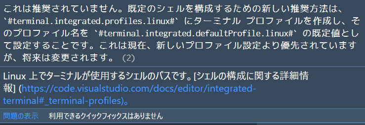

- 前提のバージョン情報

```
バージョン: 1.62.3 (user setup)
コミット: ccbaa2d27e38e5afa3e5c21c1c7bef4657064247
日付: 2021-11-17T08:11:14.551Z
Electron: 13.5.2
Chrome: 91.0.4472.164
Node.js: 14.16.0
V8: 9.1.269.39-electron.0
OS: Windows_NT x64 10.0.19041
```

- settings.json

```json
    "terminal.integrated.shell.linux": "/usr/local/bin/tmux",
```

上記のようにlinuxの場合はdefaultでtmuxを起動させたかったのでそういう設定をしていた

が、設定ファイル上で下線が出ていた



と出てきた

[Integrated Terminal in Visual Studio Code](https://code.visualstudio.com/docs/editor/integrated-terminal#_terminal-profiles)

へ遷移すると

profilesを設定してdefaultProfileで指定するようにしてねとのこと

直接指定する方法はそのうちなくなるようなので変更した

```json
    "terminal.integrated.defaultProfile.linux": "tmux",
    "terminal.integrated.profiles.osx": {
        "tmux": {
            "path": "tmux"
        }
    },
    "terminal.integrated.profiles.linux": {
        "zsh_login": {
          "path": "zsh",
          "args": ["-l"]
        },
        "tmux": {
            "path": "tmux"
        }
    },
```

<!-- textlint-disable ja-technical-writing/sentence-length -->
ディストリビューションが違う場合はデフォルトも変えられる（osx, linux, Windows）、今の所WSL2とCodespaceはlinuxなのでCodespaceの方は個別スペースの設定をいじって`zsh_login`を適用させている（tmuxが入っていない場合があるため）
<!-- textlint-enable ja-technical-writing/sentence-length -->
