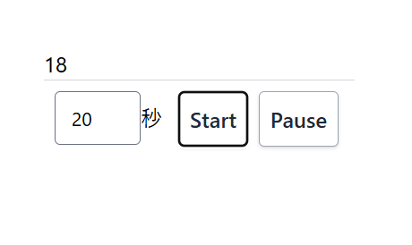

なんとなく知ってはいたが使ってみたことがなかったので使ってみた

### ドキュメント

[ウェブワーカー API - Web API | MDN](https://developer.mozilla.org/ja/docs/Web/API/Web_Workers_API)

> ウェブアプリケーションにおけるスクリプトの処理をメインとは別のスレッドに移し、バックグラウンドでの実行を可能にする仕組みのことです。時間のかかる処理を別のスレッドに移すことが出来るため、 UI を担当するメインスレッドの処理を中断・遅延させずに実行できるという利点があります。

ドキュメント内に書いてあったが、サービスワーカはWebWorkerの一種のよう、それは知らなかった…

## タイマー

NextでWeb Workerを使ったタイマーを実装してみた

Worker部分では受け取ったカウントに対して`setInterval`で1秒ごとにカウントを減らしてメインスレッドに値を返す

ポーズ、再開の機能も入れてみた

- public/timer-worker.js

```javascript
let timerId = null;
let count = 0;
let interval = 1000;

self.onmessage = function (event) {
  const { command, payload } = event.data;

  if (command === 'start') {
    if (timerId) return;

    count = payload?.count;
    interval = payload?.interval || 1000;

    timerId = setInterval(() => {
      count -= 1;

      self.postMessage({ type: 'tick', count });

      if (count <= 0) {
        clearInterval(timerId);
        timerId = null;
        self.postMessage({ type: 'done', count: 0 });
      }
    }, interval);
  }

  if (command === 'pause') {
    if (timerId) {
      clearInterval(timerId);
      timerId = null;
    }
  }

  if (command === 'resume') {
    if (!timerId) {
      timerId = setInterval(() => {
        count -= 1;

        if (count <= 0) {
          clearInterval(timerId);
          timerId = null;
          self.postMessage({ type: 'done', count });
        } else {
          self.postMessage({ type: 'tick', count });
        }
      }, interval);
    }
  }

  if (command === 'reset') {
    if (timerId) {
      clearInterval(timerId);
      timerId = null;
    }

    count = 0;
    self.postMessage({ type: 'reset', count });
  }
};
```

- pages/sample-timer/index.tsx

```tsx
import type { NextPage } from 'next';
import Head from 'next/head';
import { useEffect, useState, ChangeEvent, StrictMode, useRef } from 'react';

const SampleTimer: NextPage = () => {
  const workerRef = useRef<Worker | null>(null);
  const [count, setCount] = useState(0);
  const [paused, setPaused] = useState<Boolean | null>(null);
  const [started, setStarted] = useState<boolean>(false);

  const handleCountChange = (e: ChangeEvent<HTMLInputElement>) => {
    setCount(parseInt(e.target.value));
  };

  const startTimer = () => {
    setStarted(true);
    setPaused(false);
    workerRef.current?.postMessage({ command: 'start', payload: { count, interval: 1000 } });
  };

  const pauseTimer = () => setPaused((prev) => !prev);

  useEffect(() => {
    if (!workerRef.current) {
      workerRef.current = new Worker('/timer-worker.js');
    }

    const worker = workerRef.current;

    worker.onmessage = (event) => {
      const c = event.data.count <= 0 ? 0 : event.data.count;

      setCount(c);
    };

    return () => {
      if (worker) {
        worker.terminate();
        workerRef.current = null;
      }
    };
  }, []);

  useEffect(() => {
    if (workerRef.current) {
      const worker = workerRef.current;
      worker.postMessage({ command: !paused ? 'resume' : 'pause' });
    }
  }, [paused]);

  return (
    <>
      <StrictMode>
        <Head>
          <title>Web Worker Timer</title>
        </Head>
        <div className="p-3">
          <div className="divide-y divide-gray-300">
            <div className="">{count}</div>

            <div className="flex flex-row p-1">
              <div className="grow p-1">
                <input
                  type="number"
                  className="h-10 w-16 rounded text-sm"
                  min={0}
                  max={3600}
                  onChange={handleCountChange}
                ></input>
                秒
              </div>

              <div className="flex flex-row p-1">
                  <button
                    className="mx-1 flex items-center rounded border border-gray-400 bg-white p-2 font-semibold text-gray-800 shadow hover:bg-gray-100"
                    onClick={startTimer}
                  >
                    Start
                  </button>
                  <button
                    className="mx-1 flex items-center rounded border border-gray-400 bg-white p-2 font-semibold text-gray-800 shadow hover:bg-gray-100"
                    onClick={pauseTimer}
                  >
                    Pause
                  </button>
              </div>
            </div>
          </div>
        </div>
      </StrictMode>
    </>
  );
};

export default SampleTimer;
```

`useRef`で変数を保持できるようにし、初期処理で`new Worker('/timer-worker.js');`を使ってWorkerに処理させるスクリプトを読ませる

準備ができたらお互いにメッセージの送信、受信のやりとりをする

### メッセージの送信

postMessageで必要な情報を変数に入れて渡す

### メッセージの受信

- フロントエンド

`worker.onmessage`にコールバック関数を代入する

```tsx
worker.onmessage = (event) => {
  const c = event.data.count <= 0 ? 0 : event.data.count;

  setCount(c);
};
```

- Worker

`self.onmessage`でコールバック関数を代入する

```javascript
self.onmessage = function (event) {
// 処理
}
```


イメージ



雑な部分も結構あるけどサンプル実装ということで…

なにはともあれWeb Workerを使って何かしらの処理をバックグラウンドへ投げる方法がわかった


